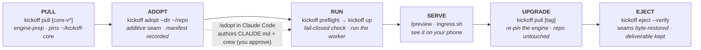
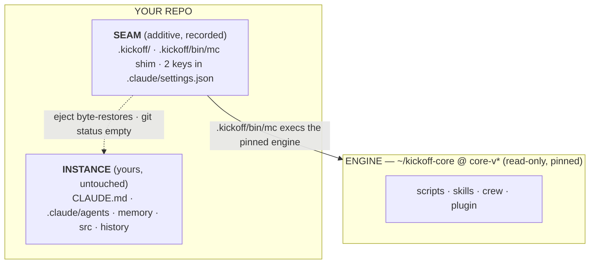

# ADOPT — drop kickoff into a repo you already have

Most engineers aren't starting greenfield. `bootstrap` spins up *new* projects; **adopt** runs the same
coordinator-plus-specialists system on the codebase you already work in — a repo that likely already has a
`CLAUDE.md`, a `.claude/` crew, and its own conventions. Adoption is **additive**: it meshes with what's
there, it doesn't overwrite it — and **every touch is recorded** in a manifest, so one command takes it back
out. That recorded reversibility is the trust guarantee: you can try it on real work without betting the repo
on it.

> **The trust guarantee, up front.** Everything `kickoff adopt` and `/adopt` write is **recorded** in
> `.kickoff/adopt-manifest.json`. `kickoff eject --verify` reverses it from that record — the seam files
> byte-restored to their exact pre-adopt bytes, and your own deliverable (crew, `CLAUDE.md`, tracker, memory)
> kept or relocated to `kickoff-data/`, with `--verify` reporting what it allowlisted as yours. It restores
> the seams and takes its wiring back out; it never touches your git history or un-makes a commit.

---

## The journey

Pin the engine once, then the journey. The engine drives the mechanical steps; `/adopt` (a Claude Code skill)
does the one intelligent step a script can't — reading your repo to author a `CLAUDE.md` + specialist crew.



| Step | Command | What it does |
|---|---|---|
| **Pull** | `kickoff pull [<tag>]` | Engine-prep: clones + pins the reviewed engine into `~/kickoff-core`. From a fresh kickoff clone this is the required first step, and it never writes into the source checkout. |
| **Adopt** | `kickoff adopt --dir <repo>` | Additive wiring: scaffolds `.kickoff/`, generates the three seam shims + `.gitignore` + charter, self-pins `core.lock`, registers the repo, enables the plugin at project scope, and records every touch in the manifest. Then hands off to `/adopt`. |
| **Run** | `kickoff preflight` → `kickoff up` | `preflight` is the fail-closed run-check; `up` starts the session-refresh supervisor (the worker). `--auto` grants autonomous reversible work; `--dry-run` proves the launch without starting anything. |
| **Serve** | the `preview` skill / `scripts/ingress.sh` | Expose a running app over Tailscale and get one link to open on your phone. |
| **Upgrade** | `kickoff pull [<tag>]` | Re-pin the engine at a reviewed `core-v*` tag. Touches only the separate core clone — never your repo's own files. |
| **Eject** | `kickoff eject --verify` | The reverse of adopt. Byte-restores every seam and keeps/relocates your deliverable; `--verify` reports the tree state and what it allowlisted as yours. |

---

## The boundary — engine · instance · seam

This is the crux, and what makes both upgrade and eject safe. Three layers, kept strictly apart:

| | **ENGINE** | **INSTANCE** | **SEAM** |
|---|---|---|---|
| **What** | kickoff's core: scripts, skills, the crew, the plugin | *your* `CLAUDE.md`, crew, memory, source, git history | the few additive edits adopt makes to wire the two together |
| **Where it lives** | a **separate read-only clone**, `~/kickoff-core`, pinned at a `core-v*` tag | your repo — **untouched** | `.kickoff/` + exactly two keys in `.claude/settings.json` |
| **Who owns it** | kickoff (`kickoff pull` moves the pin) | **you** | recorded in `.kickoff/adopt-manifest.json` (the audit + reversal spine) |
| **On upgrade** | `kickoff pull` re-pins it | never touched | seam templates re-synced from the new tag; a hand-edited seam is *refused*, not clobbered |
| **On eject** | left in place (siblings may share it) | nothing to reverse | byte-restored to the pre-adopt bytes |



**Why a separate pinned clone, not a copy?** Copying the core into every repo drifts into N hand-patched
forks. Instead the seam shim (`.kickoff/bin/mc`) execs the engine from `~/kickoff-core` at a pinned tag, and
`preflight` enforces the pin (`.kickoff/core.lock`). One engine, many repos, no drift. `kickoff pull` is a
deliberate act at the terminal — review `CORE-CHANGELOG.md`, re-pin, relaunch — never an auto-sync daemon.

---

## Mesh, don't fight

Adopt **never overwrites** your existing files — it *appends* and *adds*, and records every touch so eject
reverses it exactly. On a realistic "already using AI" repo, what adopt lands is: tracked seams under
`.kickoff/` (the charter pair, the `bin/` shims, `.gitignore`, the `memory/` corpus), a one-line `@import`
block appended to your `CLAUDE.md`, and a two-key merge into `.claude/settings.json` — every one recorded in
the manifest. Your **source, history, and crew stay byte-identical**.

- Your **`CLAUDE.md`** is never rewritten — `kickoff adopt` appends a single recorded `@import` block
  (`@.kickoff/KICKOFF.md`, wrapped in `kickoff:begin`/`end` markers; idempotent on re-adopt, byte-restored on
  eject), and `/adopt` **reads and extends** the content. Neither replaces what's there.
- Your **crew** (`.claude/agents/`) is byte-untouched.
- Your **`.claude/settings.local.json`** — the secret-bearing file — is never read, stored, logged, or
  archived. Adopt writes **no** secret.
- The seam on `.claude/settings.json` is a **merge**: it adds two keys (`extraKnownMarketplaces.kickoff-local`
  and `enabledPlugins."kickoff@kickoff-local"`) while preserving every pre-existing top-level key, and records
  the pre-edit bytes so eject can restore them exactly.

The intelligent authoring — a `CLAUDE.md` tailored to your repo and specialist subagents matching your real
domains (`frontend`, `api`, `migrations`, one per service…) — is the `/adopt` skill's work, and **you approve
every charter** before it lands. See `.claude/skills/adopt/SKILL.md` and `docs/for-ai-adopters.md`.

---

## The steps in a bit more detail

### Pull the engine (first)

```bash
kickoff pull             # engine-prep: clone + pin the reviewed engine into ~/kickoff-core
```

From a fresh kickoff clone, the **first** `kickoff pull` is engine-prep — it clones and pins the reviewed core
into `~/kickoff-core` and stops there, without writing anything (no `core.lock`, no seam-sync) into the source
checkout. Adopt (next) needs this pinned clone to self-pin `core.lock` and enable the plugin. A kickoff
**source checkout** upgrades with plain `git pull` — `kickoff pull` refuses that shape.

### Adopt

```bash
kickoff adopt --dir ~/my-repo      # additive; run /adopt afterward in a Claude Code session in the repo
```

With the engine pinned, `kickoff adopt` wires the seam and records every touch in
`.kickoff/adopt-manifest.json`. It:

- scaffolds `.kickoff/instance.env` (never clobbers an existing one) and **stamps** it with `KICKOFF_CORE_DIR`
  + `KICKOFF_CORE_REMOTE` so the seam knows which engine clone to exec;
- generates the three recorded seam shims — `.kickoff/bin/mc`, `.kickoff/bin/scan-secrets`,
  `.kickoff/bin/scan-structure` — that exec the pinned engine (machine-path-free, byte-identical across
  adopters);
- writes `.kickoff/.gitignore` so the private bits (`instance.env`, the manifest, `core.lock`, `state/`) stay
  out of git while the seams stay tracked;
- delivers the charter pair — `.kickoff/KICKOFF.md` (the engine seam) + `.kickoff/KICKOFF.local.md` (your own
  conventions) — and appends the idempotent `@import` block to your `CLAUDE.md`;
- **self-pins** `.kickoff/core.lock` to the pinned tag and **registers** the repo in the adopter registry;
- seeds blank state when absent — `.kickoff/memory/MEMORY.md` and
  `.kickoff/state/mission-control/mission-state.json`;
- enables the kickoff plugin at project scope (if the pinned core clone is present and `claude` is on PATH),
  which is what *delivers* the coordinator/specialist skills, the crew, and the proactive memory hook — none
  hand-copied in.

Then it prints the handoff: run `/adopt` in the repo to author the repo-specific `CLAUDE.md` + crew, and set
`TELEGRAM_STATE_DIR` in `.kickoff/instance.env` before `kickoff up`. (Core or plugin absent → it tells you to
run `kickoff pull` first, then re-run `kickoff adopt`.)

**Teammate clone.** The tracked seams travel with your repo, but the manifest, `core.lock`, and `instance.env`
don't. A teammate who clones the repo runs `kickoff adopt` once to regenerate their own local manifest + lock;
the `@import` block-append is idempotent, so it won't double-block an already-wired `CLAUDE.md`.

### Run

```bash
REPO_DIR=~/my-repo kickoff preflight     # fail-closed run-check: instance.env, data isolation, seam integrity
kickoff up                               # start the supervisor (the worker); --auto for autonomous, --dry-run to prove it
```

`preflight` is fail-closed by design — a mis-wired instance is blocked *before* any session starts (a blank
Telegram channel, a stale core pin, a seam that drifted from the manifest all stop it here). `kickoff up` runs
the session-refresh supervisor so a session that degrades is restarted fresh, re-grounding from your files.
Wire the phone control plane with `kickoff setup` + the `/setup` skill.

### Serve

Once something runs, put it on your phone with the **`preview` skill** (`.claude/skills/preview/SKILL.md`):

- **One service** → `tailscale serve` on a fixed port → one tailnet link.
- **≥2 services sharing an origin** (a frontend calling a relative `/api`) → the box-ingress Caddy via
  `scripts/ingress.sh` (`add-app` → `gen` → `up`), path-routed as `/<project>/<app>`, health-gated before the
  link is sent. The `funnel → public` flip stays human-approved; the default is tailnet-private.

`<project>` mirrors your repo basename, so `kickoff eject` later calls `ingress.sh remove <project>` to drop
exactly your routes and nothing else.

### Upgrade

```bash
kickoff pull                       # pin the latest reviewed core-v* tag
kickoff pull <tag>                 # pin a specific tag
```

After the engine-prep pull (above), every `kickoff pull` just re-pins the engine. Fetches into the separate
`~/kickoff-core` clone, checks out the tag (read-only, verified clean), rewrites
`.kickoff/core.lock`, prints the `CORE-CHANGELOG.md` delta, re-syncs manifest-listed seams from the new tag,
and re-runs `preflight`. **Your instance layer stays byte-identical across the pull** — the engine moves, your
repo doesn't. A hand-edited seam blocks the sync with a diff (escape hatch: `kickoff pull --force-regenerate`).

### Eject

```bash
kickoff eject --dir ~/my-repo --verify
```

The exact reverse of adopt, driven entirely by the manifest. `--verify` scans for residue and prints
`git status --porcelain` — clean means byte-for-byte pristine. The safety posture is built in:

- **Credential-safe** — `settings.local.json` is never read, stored, or archived.
- **Destruction fail-safe** — your data is **archived** (a `0600` tarball) and **left in place** by default;
  deleting the live copy needs both `--delete-data` **and** `--confirm-destroy`.
- **No clobber** — a file that diverged from the record is preserved and reported, never overwritten.
- **Your deliverable stays** — the domain crew `/adopt` authored is *kept* by default (it's yours); pass
  `--purge` to remove it too — real now that `/adopt` records every file it authors in the manifest.

Flags: `--no-archive`, `--purge`, `--delete-data --confirm-destroy`, `--data-dir <d>`, `--archive-dir <d>`,
`--remove-channel`, `--verify`, `--dry-run` (report the plan, change nothing).

---

## What stays yours

The operating model carries over unchanged: coordinator + specialists, context is scarce, minimise the
operator's plate, trust = boundaries (build/test/commit/push reversible and autonomous; **spend, secrets, and
anything destructive** stay human-approved), persistent memory. The only thing that changes is that the
"project" is your existing codebase instead of a fresh scaffold — meshed in additively, and removable in one
command.

## Honest note

The coordinator is engineer-grade but not omniscient — it works best with a tight `CLAUDE.md` describing your
repo's real conventions, and with you in the loop for the calls that need judgment. `/adopt` infers
conventions from code and will get some wrong; it says what it assumed and waits for you to correct the
charter before the crew leans on it. It multiplies an engineer; it doesn't replace one.

**More:** `.claude/skills/adopt/SKILL.md` (the authoring motion) · `docs/for-ai-adopters.md` (the AI-facing
on-ramp + the conventions to honor) · `docs/for-engineers.md` (how it works under the hood) · `CLAUDE.md`
(the full operating manual).
