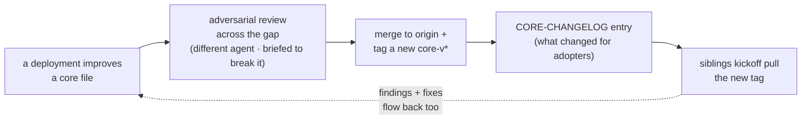

# CONTRIBUTING — how improvements flow (the bidirectional core loop)

kickoff is meant to stay **one system that builds systems, not N drifting copies.** Adopters **pull** the core
from origin (they don't rebuild it); **data stays per-instance**; and improvements flow **both ways** — an
adopter improves a core file, it is reviewed and tagged a new `core-v*` release, and siblings pull it.

> **Where this sits.** [`ADOPT.md`](./ADOPT.md) and [`docs/for-ai-adopters.md`](./docs/for-ai-adopters.md) get a
> repo *onto* the system; [`UPGRADING.md`](./UPGRADING.md) pulls a newer core *into* an adopter. This doc is the
> other direction — getting an improvement *into* the core so every deployment inherits it.

---

## 1. The shape: pull, don't rebuild

Origin (this repo, its public remote) is the **canonical, reusable system** — the source of truth. Each adopter
is a **deployment that consumes it**: the first real one is **Bliz** (a full-stack B2B product built with this
pattern), with more as adoption grows. A deployment pulls the core unchanged and feeds generalizable learnings
back.

The invariant that makes this compound instead of fragment: **an improvement flows in once** (via a tagged pull),
never as a hand-copy that each adopter re-patches. `kickoff pull` + `core.lock` + preflight `#6` enforce it —
see [`UPGRADING.md`](./UPGRADING.md).

---

## 2. What belongs in the core (vs what stays per-instance)

A change belongs upstream **only if it is reusable-that-travels.** This line is what decides longevity: draw it
cleanly and kickoff compounds; blur it and every adoption forks. The file-level split is
[`scripts/core-manifest.txt`](./scripts/core-manifest.txt) — its list is exactly what travels:

| Core — travels via `kickoff pull` (in `core-manifest.txt`) | Per-instance — stays local, **never** upstream |
|---|---|
| launcher + supervisor (`supervisor.sh`, `session-run.sh`, `start-supervisor.sh`, `go-autonomous.sh`) | the memory **facts** in `memory/` (per-org data) |
| fail-closed `preflight.sh` + the config contract `instance.env.example` | the project `CLAUDE.md` conventions + operator preferences |
| the generic scanners (`scan-secrets.sh`, `scan-structure.sh`) | the **stack-specific** gate commands (filled per-stack by bootstrap/adopt) |
| `mc-update.py` (the update CLI — the server + `mission-state.json` stay local) | the domain crew + business/GTM specialist agents |
| the agent-charter **template** | the board state, the built retrieval index, the eval corpus, `.kickoff/` |
| the memory-retrieval **code** (the built index + `eval-set.json` stay local) | |
| the pull mechanism itself (`kickoff`, `core-manifest.txt`, `CORE-CHANGELOG.md`) | |

**The rule:** a core contribution must be **generic** — no operator preferences, no per-org memory facts, no
secrets, no stack-specific commands. If it only helps one deployment, it stays in that deployment. This also
protects the loop from leaking per-instance data upstream.

---

## 3. The bidirectional loop — grounded, honestly

The value of the loop is that a bug or improvement found in *one* deployment reaches *all* of them. Adversarial
review **across the org gap** is the sharpest version: an agent (or engineer) on a *fresh* reasoning path — in a
different deployment, not the one that wrote the code — catches what the author's blind spots miss.

Honest-stage on maturity: the loop is **real but young.** It has been **validated once in practice** — a
security fix was carried across the gap between deployments — and so far it is **ad-hoc / manual.** Making it
*systematic* (attribution across repos, and moving a fix without dragging any per-instance data with it) is open
work, not a solved pipeline. Treat "flows both ways" as a proven principle with a manual mechanism today, not an
automated cross-org sync.

---

## 4. Adversarial review across the gap

Every core change lands through the same discipline the system holds everything to (see
[`CLAUDE.md`](./CLAUDE.md) → "The quality bar" and the [`review`](./.claude/skills/review/SKILL.md) skill):
**a separate agent, strongest model available, briefed to *break* it — not bless it.** A reviewer on the same
reasoning path as the author rubber-stamps; an adversarial one on a fresh path, **read + run only** (so it can't
quietly fix and hide the signal), finds the real bugs. It is **sized to the change** — trivial → skip; anything
touching security, money, or the irreversible → a full pass, with every finding verified against the actual code
before it's acted on.

The receipt is `core-v0.1` itself: before its first tag, a 5-dimension adversarial review found **19 issues
across R1+R2+R3+CLI (2 HIGH)** — pull-adopter data-path leakage and `instance.env` treated as untrusted config —
each verified by re-triggering it in a fixture, all fixed, and **re-verified by an independent adversarial pass**
([`CORE-CHANGELOG.md`](./CORE-CHANGELOG.md)). That is the bar a `core-v*` tag certifies.

---

## 5. Release discipline (lite)

A core release is deliberately just **two artifacts** — enough to keep adopters safe, no heavier process:

1. **A `core-v*` git tag** — the reviewed release. `kickoff pull` resolves **only** `core-v*` tags (a branch,
   `HEAD`, or a raw commit is refused), so the tag *is* the gate: an adopter can only pin reviewed core.
2. **A [`CORE-CHANGELOG.md`](./CORE-CHANGELOG.md) entry** — reverse-chronological, describing what changed *for
   an adopter*. This is what a sibling reads before pulling (`UPGRADING.md` §0).

Plus, only when they actually change: update [`scripts/core-manifest.txt`](./scripts/core-manifest.txt) if the
travelling file set changed, and [`scripts/instance.env.example`](./scripts/instance.env.example) if a config
variable *name* was added or renamed. Those two — the variable **names** and the **file set** — are the entire
**stability contract** between core and adopters; they change only across versions, and the changelog is where a
break is announced.

---

## 6. Landing a core change (the mechanics)

1. **Keep it generic** (§2) — no per-instance data, prefs, or secrets. If it's deployment-specific, it stays
   local.
2. **Adversarial-review across the gap** (§4) — a different agent briefed to break it; verify each finding
   against the code; fix; light re-review. Full pass for security / money / irreversible changes.
3. **Update the contract only if it moved** — `core-manifest.txt` (file set) and/or `instance.env.example`
   (variable names). If you changed neither, an adopter's `instance.env` keeps working untouched.
4. **Add a `CORE-CHANGELOG.md` entry** — what changed, in adopter-facing terms.
5. **Tag + push the release:** `git tag core-v0.3 && git push --tags`. (Until a `core-v*` tag exists, `pull` has
   nothing to pin — the maintainer tags the release first.)
6. **Siblings inherit it** by running `kickoff pull` ([`UPGRADING.md`](./UPGRADING.md)); preflight `#6` verifies
   the pin on their next start.

> **Self-modification stays gated.** A change to an agent's own charter, `CLAUDE.md`, or `.claude/settings.json`
> is not edited in place by an agent — it is staged as a human-run, reversible `scripts/wire-*.sh` installer the
> human approves (the pattern of `scripts/wire-canon-into-charters.sh`). The human approves every change to the
> crew; full self-mutation is a direction, not a license (see [`CLAUDE.md`](./CLAUDE.md) → "Evolving the
> system").
