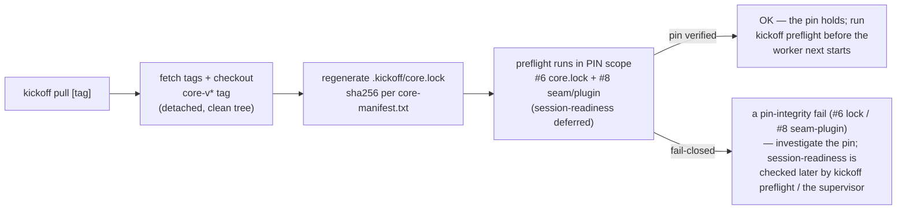

# UPGRADING — pull a newer core (existing adopter)

You already run kickoff and want to move to a newer **core** release. The core flows in via
**`kickoff pull`**, pinned to a `core-v*` git tag — it is **never hand-copied**. This is the recurring
upgrade motion; the one-time drop-in is [`ADOPT.md`](./ADOPT.md), and the per-version log you read first is
[`CORE-CHANGELOG.md`](./CORE-CHANGELOG.md).

> **Why pull instead of copy?** A copied core drifts into N hand-patched forks — an improvement to origin has
> to be re-applied everywhere, and kickoff decays from a *system* into a *template that rots*. `kickoff pull`
> maintains a **separate, read-only, tag-pinned clone** and regenerates an integrity lock the preflight
> enforces, so origin's improvement flows in **once** and no patched copy is ever born.

---

## 0. Read the changelog before you pull

[`CORE-CHANGELOG.md`](./CORE-CHANGELOG.md) records what changed per `core-v*` version (reverse-chronological).
Read the entries between your pinned version and the target **before** pulling — a newer core is
**self-modification of the code your box runs**, so it is a deliberate act, not a background sync.

An upgrade can only break you through the **stability contract** (§5): the `instance.env` variable *names* and
the `core-manifest.txt` file set. If a release changed either, the changelog entry says so — that is the one
place a breaking change surfaces.

> **Engine parity:** the system runs on Claude Code and opencode, and every capability gap between
> them is **recorded, never silent** — see [`docs/PARITY.md`](./docs/PARITY.md), enforced by the
> release gate; run `bash scripts/parity-report.sh` to see your own tree's parity state.

**This release brings the opencode wiring to adopters.** A `kickoff pull` now delivers the
`.opencode/` surface — the five agent charters (`.opencode/agent/`) and two plugins
(`.opencode/plugins/`) — plus the adopter config template (`scripts/templates/opencode.json`,
deliberately minimal: no model pin, no provider stanza — see the README beside it). Nothing is
required of you: pull delivers it, and the release is non-breaking (the manifest file-set grew,
per the stability contract, with the entry recorded in `CORE-CHANGELOG.md`).

---

## 1. The upgrade, in one command

`kickoff pull [<tag>]` runs from your **read-only core clone** (`$KICKOFF_CORE_DIR`, default `~/kickoff-core`).
Because that clone sits at a **detached-HEAD** pinned tag, the front door **requires `REPO_DIR`** — it must
write your lock (and resolve your `instance.env`) against *your* repo, never the shared core clone:

```bash
# pin the LATEST reviewed core release:
REPO_DIR=~/my-repo bash ~/kickoff-core/scripts/kickoff pull

# or pin a SPECIFIC tag you've read in CORE-CHANGELOG.md:
REPO_DIR=~/my-repo bash ~/kickoff-core/scripts/kickoff pull <tag>
```

What that does, in order:



- **`pull` resolves only a `core-v*` release tag** — never a branch, `HEAD`, or a raw commit. A reviewed tag
  is the gate; the bare-ref fallback that could pin un-reviewed code past the changelog was removed.
- With **no `<tag>`**, it pins the **latest** `core-v*` tag (`git tag -l 'core-v*' | sort -V | tail -1`).
- It **refuses a dirty (hand-edited) clone** rather than laundering tampered files into the lock — the clone
  must stay read-only (§3).
- It rewrites `.kickoff/core.lock` from `scripts/core-manifest.txt` **as read in the pinned checkout**, so each
  tag defines its own core set, then runs the preflight to verify the pin it just wrote.

`kickoff pull` clones the core on the first run and fetches on every run after — it is idempotent; re-running
it is safe.

---

## 2. What `core.lock` + preflight #6 guarantee

`.kickoff/core.lock` is a manifest of `<sha256>  <path>` lines, one per file in `scripts/core-manifest.txt`,
checksummed relative to your core clone. **preflight check #6** re-verifies it on **every** start (standalone,
and from the supervisor before a session launches):

- Every pinned core file must match its recorded sha256. **A mismatch = a core file was hand-edited
  (copied-and-patched) = FAIL-CLOSED** — the exact fork-fragmentation the pull model exists to kill.
- The check is **fail-closed by construction**: if `sha256sum` is unavailable, the checksum base can't be
  resolved, or the manifest lists a path that escapes the core tree, it **fails** rather than false-passing. A
  green preflight that green-lit a patched core would be worse than no check at all.
- The **pull mechanism itself is self-pinned** — `kickoff`, `core-manifest.txt`, and `CORE-CHANGELOG.md` are in
  the manifest, so a hand-edit to the turnkey or the manifest is caught too.

> **Scope, honestly:** `core.lock` is **unsigned** — this is a drift / copied-and-patched guard (it catches the
> fat-finger and the well-meaning local tweak), **not** anti-tamper. Someone who can rewrite core files can
> regenerate the lock. It stops accidental fragmentation, not a determined attacker.

---

## 3. If preflight flags core drift

A `#6` failure means the pinned clone no longer matches the lock. Two distinct diagnostics, two fixes:

**A. `core.lock checksum MISMATCH — a core file was hand-edited`** — a file inside `$KICKOFF_CORE_DIR` was
edited. The clone is **read-only**; never patch it in place. Restore it to the pinned tag and re-pull:

```bash
git -C ~/kickoff-core reset --hard <tag> \
  && git -C ~/kickoff-core clean -fdx \
  && REPO_DIR=~/my-repo bash ~/kickoff-core/scripts/kickoff pull <tag>
```

(Use *your* pinned tag. `reset --hard` + `clean -fdx` restore the clone to a pristine tree; the re-pull
regenerates the lock from the clean core.)

**B. `NONE of its pinned files exist under <base>`** — this is a *misconfig*, not a hand-edit: `KICKOFF_CORE_DIR`
doesn't point at your `~/kickoff-core` clone. Set `KICKOFF_CORE_DIR` in `.kickoff/instance.env` to the clone, or
run `kickoff pull` to (re)create it.

A related guard: preflight fails if **the core that is actually running is not the pinned `KICKOFF_CORE_DIR`**
(a patched running copy can't hide behind a pristine declared clone) — launch the supervisor **from** the
pinned clone, or fix `KICKOFF_CORE_DIR`.

To improve on a core file, don't edit the clone — send it upstream so it flows back as a new tag. See
[`CONTRIBUTING.md`](./CONTRIBUTING.md).

---

## 4. Your data is not the core — keep them separate

Only the **reusable system** travels via `kickoff pull`. Your **per-instance data stays local** and is *not*
in the manifest, so a pull never touches it:

| Stays local (per-instance, gitignored) | Where |
|---|---|
| Your board state | `mission-control/mission-state.json` |
| Your built retrieval index | `memory-retrieval/memory-index.db` |
| Your eval corpus | `memory-retrieval/eval-set.json` *(the template travels)* |
| Your config + the lock + supervisor locks | `.kickoff/` (`instance.env`, `core.lock`, …) |
| Your durable facts | `memory/` |

The isolation is **enforced**, not just documented: because a pull adopter runs the unchanged core from
*outside* its own repo, `preflight` **hard-requires** `MC_STATE_FILE` / `MEMORY_DB` / `MEMORY_HOOK_LOG` to be
set and to resolve **inside your repo** whenever `core.lock` is present — and `mc-update.py` **refuses to write**
the board when its only target would be a detached-HEAD core clone. Left unset, this instance's board + memory
would otherwise land in the shared clone (a cross-instance leak and a blank board on your phone). Keep those
vars anchored on `${REPO_DIR}` in `.kickoff/instance.env` (the defaults in
[`scripts/instance.env.example`](./scripts/instance.env.example) already are).

---

## 5. Why upgrades stay non-breaking — the stability contract

The contract between the core and its adopters is exactly **two things**:

1. **The `instance.env` variable *names*** ([`scripts/instance.env.example`](./scripts/instance.env.example)) —
   the values are yours, but the *names* are the frozen interface the core scripts read against.
2. **The `core-manifest.txt` file set** ([`scripts/core-manifest.txt`](./scripts/core-manifest.txt)) — which
   files travel.

Both change **only across core versions**, and every such change is recorded in
[`CORE-CHANGELOG.md`](./CORE-CHANGELOG.md). So an upgrade is safe as long as you: read the changelog (§0), keep
your `instance.env` supplying the current variable *names*, and let `pull` (not a hand-copy) move the file set.
If a release renames or adds a required var, the changelog entry is where you'll see it — update your
`instance.env` accordingly, then `kickoff pull`.

---

## 6. `pull` is a human-run turnkey, never an auto-sync daemon

`kickoff pull` is **always a deliberate act at the terminal** — review the changelog, pull, re-launch. It is
**never** an auto-sync daemon and **never** a channel-driven action: pulling a new core *is* self-modifying the
code the box runs, so — exactly like wiring a hook or editing a charter — it stays a human decision. A Telegram
message must never be able to trigger a pull (see the prompt-injection posture in [`CLAUDE.md`](./CLAUDE.md)).

After a pull, restart the worker so the fresh session runs on the newly-pinned core; the supervisor re-runs the
preflight (including `#6`) on start, so a mis-pinned or drifted core is blocked before any session begins. See
[`RUNNING.md`](./RUNNING.md) for the supervisor + control plane.
