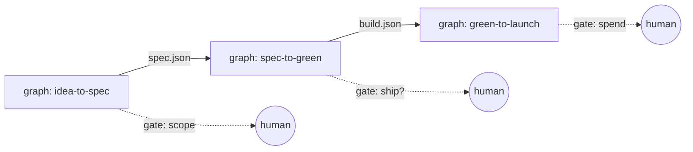
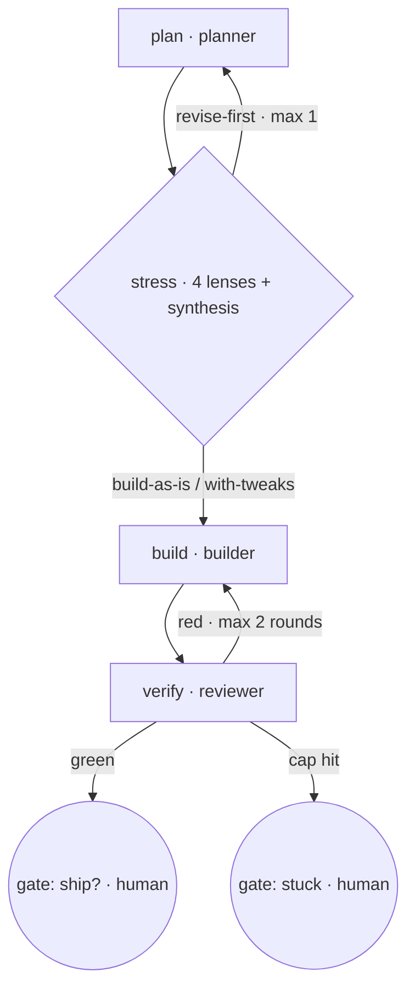
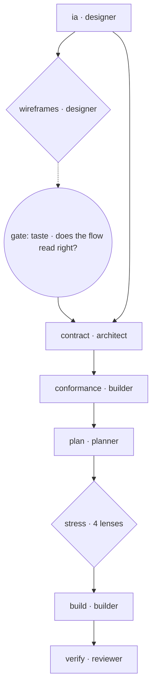

# Agent graph model — design doc

**Status:** design, unbuilt. Nothing here has run.
**Date:** 2026-08-19. **Author:** planner (dispatched).
**Brief:** the operator's idea of 2026-08-19 17:03 — a modular graph of collaborating specialist agents, composed of sub-graphs, with loops.

---

## 0. The one-paragraph answer

The idea is right about the *shape* and wrong about the *order*. A graph of specialist nodes with deterministic edges is real leverage, because it moves the "what happens next" decision out of a degrading coordinator context and into a script that does not degrade. That is already proven twice in this repo: `.claude/workflows/pr-adversarial-review.js` and `.claude/workflows/spec-adversarial-review.js` both run multi-agent fan-out with schema-validated returns and deterministic branching. The wrong order is building the graph *framework* — a spec format, a validator, a code generator, a crew of design/gtm/product/architecture specialists — before one graph has run end to end on real work. This doc specifies the model, and then argues hard for a five-node thin slice that uses only the four charters that already exist.

---

## 1. Node schema

A node is **one dispatch**: one agent, one brief, one artifact, one proof.

```yaml
- id: verify-slice              # unique in the graph, kebab-case
  function: eng                 # the Mission Control functions row it writes to
  agent: reviewer               # MUST resolve to .claude/agents/<name>.md
  tier: {model: opus, effort: medium}
  in:  [plan.path, build.diff]  # typed refs to upstream node outputs
  out:
    artifact: /abs/path/or/none # the real output, on disk
    returns:                    # the SMALL structured return the edges branch on
      green: boolean
      blockers: string[]
  proof:
    class: executable           # executable | structural | human
    cmd: "npx vitest run"
    expect: exit 0
    negative: "revert src/x.ts; the same cmd MUST exit non-zero"
  gate: none                    # none | spend | destructive | taste
```

Three rules that are not negotiable.

**Tools are not a node field.** Least privilege lives in the charter frontmatter and nowhere else — `planner.md:4`, `builder.md:4`, `reviewer.md:4`, `deployer.md:5`. A second declaration in the graph spec is a second source of truth, and it will drift the day someone tightens a charter. The node names a charter; the charter owns the privilege. `TOOLING.md:39-65` is the reason this matters — focus, blast radius, and context cost all key on it.

**The artifact goes on disk; the return stays small.** The return is what edges read. Putting a whole document in a return burns the parent's context and makes the branch logic parse prose. `memory/workflow-brief-must-pin-the-artifact.md` is the cost of getting the other half wrong: a workflow whose `args.worktree` was `undefined` produced 37 agents that all reviewed the wrong tree and reported confidently. So the return carries **the path plus a verdict**, and a node whose input path is unresolved must abort loudly, never proceed from cwd.

**Every node declares a proof, and proofs come in exactly three classes.** The quality bar (`CLAUDE.md:235-261`) says a thing is not done without a runnable check. Prose work cannot have a unit test, so be honest about the class rather than faking one:

| Class | What it is | Example | Fires an automatic edge? |
|---|---|---|---|
| `executable` | a command + expected exit code | `npx vitest run` → 0 | yes |
| `structural` | schema-valid return + a file that exists and parses, with a named negative control | metrics spec where every metric names an event the code actually emits (`rg` the event name) | yes |
| `human` | a taste call | "does this wireframe read right?" | **no — it is a gate** |

**A node whose proof class is `human` may not have an automatic outgoing edge.** This is the single rule that stops the graph becoming a diagram. If you cannot state the input that makes the proof fail, you do not have a proof — you have a gate wearing a proof's clothes.

### The existing four map unchanged

| Node | Charter | Artifact | Proof class |
|---|---|---|---|
| `plan` | `.claude/agents/planner.md` | a plan doc | structural (has the five sections + a named negative control) |
| `build` | `.claude/agents/builder.md` | a diff | executable (the plan's own test command) |
| `verify` | `.claude/agents/reviewer.md` | a verdict | executable (it re-runs the proof itself — `reviewer.md:11`) |
| `ship-prep` | `.claude/agents/deployer.md` | a production build + deploy config | executable for the prep half; the go-live is a `spend` gate (`deployer.md:20-28`) |

No charter changes needed. That is deliberate — the graph should be a way of *arranging* the existing crew before it is a reason to grow one.

### The new functions the operator's example implies

All four are **proposals**, not decisions. `CLAUDE.md:457-468` puts every new agent behind the human's approval and requires it be authored from `.claude/agent-charter-template.md`. Listed with the honest proof problem each one has:

| Proposed node | Artifact | Proof | Honest problem |
|---|---|---|---|
| `designer` | wireframe screenshots + a component spec | structural: the screenshot file exists at the pinned path and the `preview` skill served the route | the render is not the device (`CLAUDE.md:329-333`). Visual sign-off is a **human gate**, always. |
| `architect` | an architecture note + module boundaries | executable: run `.claude/workflows/spec-adversarial-review.js` on the note; pass if `verdict !== 'revise-first'` (schema at `spec-adversarial-review.js:64-75`) | none — this is the cleanest of the four, because the check already exists |
| `product` | a metrics spec (JSON) | structural: every metric names an event string that `rg` finds in the codebase. Negative control: add a metric naming a nonexistent event; the check must go red | only meaningful once there is a running product emitting events |
| `gtm` | campaign copy, positioning | **human** | on a project with no users, this node produces work nobody reads and progress nobody has. See §8. |

---

## 2. Edge semantics

**An edge fires on a deterministic evaluation of the upstream node's structured return, computed in JavaScript.** Never on an agent's prose. An agent that writes "looks good to me" is not a branch condition; `{green: true}` from a schema-validated return is. The schema mechanism is real and in use — `pr-adversarial-review.js:38-71` and `spec-adversarial-review.js:41-75` both define JSON Schemas passed as `agent(prompt, {schema})`.

Three edge kinds, and the correct primitive for each:

**Sequential dependency** — B consumes A's artifact. JS: `const a = await agent(...); const b = await agent(...a.path...)`. Use it whenever B's brief must contain A's output. Also use it, per `CLAUDE.md:344`, whenever both nodes touch the same file — two agents on one file is a known-bad pattern regardless of what the graph says.

**Fan-out** — independent lenses on the same input. JS: `parallel(items.map(i => () => agent(...)))`. Verified use: `spec-adversarial-review.js:96-98`, four lenses over one doc.

**Join / barrier** — the downstream node needs the *complete* set. JS: `await parallel([...])` then one `agent()` on the collected array. Verified use: `spec-adversarial-review.js:100-107` — the synthesis node deduplicates, weighs severity and resolves contradictions, so a partial set gives a wrong answer.

**When a barrier is genuinely required, and when `pipeline()` is correct.** The repo shows both sides:

- **Barrier required** when the downstream output would be *wrong* with a partial set: adjudication, deduplication, ranking, "pick the best of N". `spec-adversarial-review.js` is this case.
- **`pipeline()` correct** when each upstream result can be processed independently the moment it lands: per-finding verification, per-file fix, per-item enrichment. `pr-adversarial-review.js:97-116` is this case — each dimension's findings go straight into their own verifier fan-out without waiting for the other four dimensions to finish. No barrier, so a slow lane does not stall the fast ones.

The test is one question: *would this node's answer change if it saw only half the inputs?* Yes → barrier. No → pipeline. Do not add a barrier for tidiness; it converts your parallelism into your slowest lane.

*(Honest note on `pipeline()`: I am reading its streaming semantics off the two-stage call shape at `pr-adversarial-review.js:97` plus the brief's description. I did not find the harness's own API documentation in this repo.)*

---

## 3. Loops

Every loop needs a predicate the *script* can evaluate, a hard iteration cap, and a cost cap. A loop without all three is a spend leak with a nice diagram.

### 3.1 refine-until-green (build ↔ verify)

- **Exit predicate:** the proof command exits 0 **and** the reviewer's return is `{green: true}`.
- **Who evaluates:** the workflow script runs the proof command itself and reads the exit code. The reviewer's opinion is the second half, not the first. This matters — `reviewer.md:11` already says "run it yourself", and the script running it too means a reviewer that dies cannot look like a reviewer that approved.
- **Max iterations:** 3.
- **Spend ceiling:** the script counts its own `agent()` calls against a declared `max_calls`. On exhaustion it stops and raises a human gate — "3 rounds, still red on X, here is the last output" — it does not try a fourth.

### 3.2 adversarial find-until-dry

- **Exit predicate:** a round returns **zero confirmed findings at severity ≥ should-fix**. "Confirmed" means survived the refute-by-default verifier (`pr-adversarial-review.js:106-113`, where `confirmed = realVotes >= 1`).
- **Why not "zero findings":** because a fresh lens always finds *something*. A predicate of literal zero never fires, and the loop runs until the money is gone. Severity-thresholded is the only version that terminates.
- **Who evaluates:** JS, `confirmed.filter(f => f.severity !== 'P3').length === 0`.
- **Max iterations:** 2 rounds.
- **Non-convergence tripwire:** if round N+1's confirmed count is greater than or equal to round N's, stop immediately and escalate. The loop is not converging, and another round will not fix that.
- **Ceiling:** bounded by rounds × panel size, both fixed at authoring time.

### 3.3 judge-panel-until-consensus

- **Exit predicate:** k of n judges return the same enum value.
- **Who evaluates:** JS tally over schema'd enum returns.
- **Max iterations:** one re-vote. Then majority wins and the split is reported to the human as a fact.
- **Do not add judges to break a tie.** They share a model and correlate; you buy a more expensive coin flip. Report the split.

### 3.4 The loop to refuse: "iterate until it looks good"

This is not a loop. There is no predicate. Model it as a `taste` gate node (§5) and say so out loud when the operator asks for it. `CLAUDE.md:222-227` already treats render → look → refine as a human step for exactly this reason.

### 3.5 The global backstop, and its negative control

Every graph declares `max_nodes`, `max_rounds`, and `max_calls`. The script enforces them itself.

**The negative control for the entire loop model:** run a graph whose exit predicate is deliberately unsatisfiable. It must stop at the cap and raise a gate. If it spins, the model is not safe to run unattended, and no amount of correct behaviour on the happy path changes that. This test is not optional and it is not a nice-to-have — it is the one that decides whether the operator can leave a graph running while he is away from his phone.

*(`budget.remaining()` was named in the brief. I did not find it in this repo, so the design counts calls itself. If the harness does provide it, prefer it — a real token budget beats a call count.)*

---

## 4. Composition — "a combination of graphs"

**The verified constraint:** workflow subagent metadata records `{"agentType":"workflow-subagent","spawnDepth":1}`. Workflow agents are depth-1. A workflow cannot nest a workflow that nests a workflow.

**Design within it: compose by sequence over files, not by nesting over the call stack.**



Each box is a separate `Workflow` run. The coordinator chains them by passing the previous run's output file as `args` to the next. The **file is the seam**, which is better than a call stack for three reasons: it survives a session kill, it is readable by the operator, and it is diffable in git.

The typed contract every graph returns:

```json
{
  "contract_version": 1,
  "graph": "spec-to-green",
  "run_id": "wf_...",
  "artifacts": { "plan": "/abs/...", "diff": "/abs/..." },
  "verdict": "green",
  "next_gate": { "kind": "spend", "ask": "deploy to X, ~$5/mo — go?" }
}
```

The consuming graph validates this file at its first line and **aborts loudly if a required path is missing** — not "proceeds from cwd". That is the direct lesson of `memory/workflow-brief-must-pin-the-artifact.md`, where `undefined` in a rendered brief stopped none of 37 agents.

What would have to change for true nesting: a `Workflow` primitive callable from inside a workflow script. It does not exist today. Do not design around waiting for it — the file seam is not a workaround, it is the better shape anyway.

---

## 5. Where the human sits

The trust boundary is unchanged: **spend and destruction** (`CLAUDE.md:288-305`). Everything else the graph runs on its own, including commit and push.

A gate is a **first-class node that calls no agent**. It does four things:

1. Writes the ask to the operator's plate — `.kickoff/bin/mc plate "<the one-line ask>"` (verb at `mission-control/mc-update.py:374`).
2. Returns `{gated: true, kind, ask, artifacts}` and the workflow **ends cleanly** — status `completed`, not crashed.
3. The coordinator relays one line to Telegram.
4. The human answers one word. The coordinator starts the next graph with `args.approved = true`.

Three gate kinds: `spend`, `destructive`, `taste`. The first two are the charter's hard line. The third is where every "looks good?" loop gets modelled.

### Is `resumeFromRunId` sufficient? Partly, and it is probably the wrong tool here.

What I verified about the run substrate. The per-run journal is content-keyed: `{"type":"started","key":"v2:<sha256>","agentId":"..."}` and matching `{"type":"result",...}` records. The run record carries `"runId"` and `"status":"completed"`.

What that shape implies. A resume **re-executes the script from the top and replays completed `agent()` calls whose content key matches**. There is no suspended stack to inject an answer into. Three consequences the design must respect:

- The human's answer must arrive as an **argument or a file the script reads**. It cannot be handed to a paused frame.
- If the answer changes a *downstream* prompt, that node's key changes and it correctly re-runs. Cheap.
- If the answer changes an *upstream* prompt, everything after it re-runs. Expensive. **So gates go late in a graph, never early and often.**

What is missing, plainly: I found no documented pause verb and no documented way to pass new args on resume. I could not determine either from this repo.

**Recommendation: do not depend on resume for the first build.** Split at the gate — the gate is the end of graph N, and the answer is an argument to graph N+1. That works with what is proven to exist today, and it makes the pause visible in git and on the board rather than hidden in a run journal. Adopt `resumeFromRunId` as an optimisation once its argument-passing semantics are confirmed (open question #3).

---

## 6. Observability

Map onto Mission Control. Do not build a second board — `CLAUDE.md:111-122`.

| What the operator asks | Where it lives | Verb |
|---|---|---|
| which node is live | `functions` row per node function | `mc function <fn> active "<node-id>: <what>"` (`mc-update.py:465-474`) |
| what just landed | the 📡 activity feed | `mc log <fn> "<what landed>"` (`mc-update.py:475-479`) |
| how far through | the `in_progress` item's stage | `mc stage <idx> <build\|test\|review\|scan\|ship>` (`mc-update.py:453-457`, `STAGES` at line 73) |
| what needs me | `human_plate` | `mc plate "<ask>"` (`mc-update.py:374`) |
| what died | the run journal | `python3 scripts/orphaned-work.py --why <run-id>` (`scripts/orphaned-work.py:20`) |

Four things to get right, each of which is a real bug if you skip it.

**The feed has a hard cap of 50 entries** (`ACTIVITY_CAP = 50`, `mc-update.py:67`). Budget two entries per node — start and end. A 12-node graph then eats 24 entries, half the feed, and one run erases the previous run's history. Log node boundaries only, never a play-by-play. The charter template says the same thing in words (`agent-charter-template.md:44-46`); the cap says it in code.

**Both the agent and the script write.** The agent owns its own row (mandated by `agent-charter-template.md:39-51`), which is what makes the board a live confluence rather than a coordinator relay. The script writes the graph-level lines: run start, phase transitions, run end.

**The script must close the row the agent left open.** An agent that dies mid-node leaves its `functions` row reading `active` forever, and the board then lies in the most dangerous direction — it shows work happening where nothing is happening. On every node return *or absence*, the script flips the row. This is `CLAUDE.md:241-244` applied to the board: a reviewer that died and one that found nothing produce the same silence, and silence is not consent.

**The run id goes on the board once.** One feed line, `graph <name> started: <runId>`. That single string is what makes `orphaned-work.py --why <run-id>` usable from the operator's phone over SSH when something is stuck.

---

## 7. Authoring and versioning

**Answer: prose in, spec file as the reviewed artifact, generated JS out — but not yet.**

The eventual shape:

- **Spec:** `graphs/<name>.graph.yaml`, committed in the project repo. YAML because a graph diff must be readable on a phone.
- **Validator:** `scripts/graph-validate.py`. Checks that every `agent:` resolves to a real `.claude/agents/*.md`; every node declares a proof of a stated class with a stated negative control; every loop has an exit predicate, a max, and a call cap; every edge reads a field that exists in the upstream node's declared return schema; no cycle is unbounded. **This validator is what makes the model real instead of a diagram**, and it is the cheapest piece in the whole design.
- **Codegen:** `scripts/graph-emit.mjs` → `.claude/workflows/<name>.js`, generated and committed, with a `GENERATED — edit the .graph.yaml` header.
- **Versioning and review:** the spec is config, reviewed like config. Size the review to the diff per the `review` skill (`.claude/skills/review/SKILL.md:13-22`). A graph that touches spend or destruction gets the full adversarial pass. `contract_version` bumps on a breaking output change.

**And the honest counter: do not build any of that yet.** The repo has exactly two workflows today, both hand-written JS, both working. `CLAUDE.md:198` — no premature abstraction; abstract when duplication earns it. The spec-plus-validator-plus-codegen chain earns its keep at roughly the third graph, when two hand-written files have started copying each other. Before that it is three new pieces of infrastructure protecting one file.

For the thin slice: **one hand-written `.claude/workflows/spec-to-green.js`.**

---

## 8. The honest part

### What is real leverage

1. **Determinism at the seams.** Today the coordinator decides "review now? build now? is this done?" in prose, and that decision quality degrades as its context fills (`CLAUDE.md:124-155`). A workflow script does not degrade. This is the largest single win and it is already demonstrated twice in this repo.
2. **Context partitioning, enforced rather than remembered.** Each node reads in its own window, so its context never lands in the coordinator's (`CLAUDE.md:146-151`). A graph is a delegation forcing-function.
3. **Cost routing becomes executable.** The model routing table (`CLAUDE.md:362-372`) is currently a rule a coordinator has to remember every dispatch. As a node field it is checked, not recalled. *(Conditional on open question #2.)*
4. **Structured salvage.** Agent transcripts and the run journal already survive a SIGKILL (`scripts/orphaned-work.py:5-14`). A graph makes recovery a defined resume point rather than an archaeology session.

### What is a diagram that costs more than it returns

1. **The 12-node graph where 3 nodes do the work.** The failure is not wasted tokens — it is that the board *looks busy*. A gtm node writing a campaign for a product with no users produces a full lane, a filled feed, and zero progress. **Detection rule: if a node's artifact is never an input to another node and no human reads it within a week, delete the node.**
2. **Loops that never converge.** Covered in §3. The find-until-dry loop is the specific trap, because "no findings" reads like a reasonable exit and is in fact unreachable.
3. **Specialists with nothing to do.** `CLAUDE.md:453-456` sets the bar at a domain recurring with no owner — the third comms-type task, not the first diagram with a comms-shaped hole. A graph inverts this pressure: drawing the box makes you want to fill it. Add a node when the function has recurred three times in real work.
4. **The framework before the first run.** Building the spec format, validator and codegen before one graph has executed end to end is the largest risk in this brief. It is also the most enjoyable part of it, which is precisely why it happens.
5. **Fake determinism.** An edge branching on an agent's prose verdict is not deterministic — it only looks it from the outside. Branch on schema'd enums and command exit codes, nothing else.
6. **A quiet board on a long run.** A graph that runs for an hour with no MC writes leaves the operator pinging "are you there?" — an observed failure, `CLAUDE.md:350-356`. Every node writes; the script writes on behalf of a node that dies.

---

## 9. The thin slice

**`spec-to-green` — five nodes, one file, real work, no new agents.**

It is the smallest graph containing all four structural features that the whole model rests on: a sequential edge, a fan-out with a barrier, a bounded loop, and a human gate.



| # | Node | Charter / body | Proof |
|---|---|---|---|
| 1 | `plan` | `planner` | structural — the plan file has the five sections from `planner.md:10-16` and a named negative control (`planner.md:29-33`) |
| 2 | `stress` | **reuse `.claude/workflows/spec-adversarial-review.js` as-is** | executable — its own `verdict` enum, `spec-adversarial-review.js:68`. Zero new code. |
| 3 | `build` | `builder` | executable — the plan's own named test command, exit 0 |
| 4 | `verify` | `reviewer` | executable — the script re-runs the proof command; the reviewer returns `{green: bool}` |
| 5 | `gate:ship` | none | writes `mc plate`, returns, ends |

**The proof of the graph — this is the success criterion.** A scripted run against a fixture task whose first build attempt is deliberately wrong must: (a) go red at `verify`, (b) loop back to `build` exactly once, (c) go green, (d) stop at `gate:ship` without deploying anything, and (e) leave a `functions` row and a plate item on the board.

**The negative control, and it is the one that decides everything.** Run the same graph with an exit predicate that can never be satisfied. It must halt at the round cap and raise the stuck-gate. If it spins, the model is unsafe to run while the operator is away, and passing the happy-path test does not redeem that.

**Deliberately NOT in the slice:** no spec file format, no validator, no codegen, no `designer` / `product` / `gtm` / `architect` nodes, no new charters, no graph nesting, no `resumeFromRunId`, no MC schema changes. One hand-written file at `.claude/workflows/spec-to-green.js`.

**Why this slice:** it uses only charters that exist, reuses an existing workflow as an entire node, and tests the two questions that decide whether the larger idea is worth building — *does a loop stop*, and *does a gate pause cleanly*.

---

## 10. What I could not determine from the repo

Stated as unverified, not as absent:

- `budget.remaining()` — named in the brief, not found in this repo. The design counts `agent()` calls itself so it works either way.
- `resumeFromRunId` argument-passing semantics — no documentation found. The content-keyed journal is real evidence about *how* resume must work; it is not documentation of the verb.
- The one-level nesting limit — `spawnDepth: 1` in run metadata is evidence, not a documented rule.
- Whether `agent()` accepts per-call `model` / `effort`. Not present in either workflow file. `scripts/session-run.sh:473,480` proves `--model` / `--effort` exist for a *session*; that is a different layer.

## 9a. Build log — the slice is built, and both paths ran (2026-08-19)

`.claude/workflows/spec-to-green.js` exists. It ran twice against a fixture, control first.

| Run | Args | Result | Calls |
|---|---|---|---|
| `wf_4259c59c-b85` | `neverGreen: true` | `verdict: stuck` after 2 rounds, stuck-gate raised, **no spin** | 5 |
| `wf_fda4a333-2b7` | `neverGreen: false`, fixture reset to RED | `verdict: green` at round 1, ship-gate raised | 3 |

The control ran **first, deliberately**. §3.5 says a graph that cannot halt on an unsatisfiable
predicate is unsafe to leave running unattended, and that is not a property you check after you
have started trusting the thing. The green run then closed the one edge the control could not
reach by construction — `green → gate:ship`.

The coordinator re-ran the fixture proof itself after the green run (`OK`, exit 0), rather than
relaying the reviewer's word for it.

### Three corrections this file forced

1. **§3.1 is wrong: the script cannot run the proof.** A workflow script has no filesystem and no
   shell. The `reviewer` runs the proof command and returns the exit code it observed. The property
   §3.1 wanted survives by a different mechanism — `agent()` returns **null** when a subagent dies,
   and the script reads null as RED. A reviewer that died therefore cannot pass for one that
   approved, which was the whole point.
2. **§6 is wrong in the same way: the script cannot write Mission Control.** Node-level rows come
   from the agents themselves, which their charters already require. Graph-level lines come from
   the coordinator, around the run.
3. **A workflow file added mid-session is not in the name registry.** `Workflow({name})` failed with
   *not found* while `Workflow({scriptPath})` ran it fine. Charters reload per dispatch
   ([[a-charter-edit-lands-on-the-next-dispatch]]); the workflow registry does not. Invoke a new
   graph by path until the next session.

### And one finding worth more than the run

A negative control **silently became a no-op and still printed red**. Two control bodies were both
53 bytes and written inside the same second, so CPython's `(mtime_seconds, size)` bytecode cache key
collided and the second control re-executed the first one's bytecode — emitting the first one's
failure text. It was caught only because the plan had written down the **exact** assertion each
control must produce, and the message was the wrong one.

This raises the bar on §1's proof classes. A `structural` or `executable` proof must name not just
its negative control but **the exact failure text that control must produce**. "It went red" is not
an assertion. See [[predict-a-control-s-exact-failure-text]].

---

## 10a. Corrections from the harness contract (coordinator, 2026-08-19)

Four of §10's unknowns are answered by the Workflow tool's own contract, which the planner could
not see from inside the repo. **Documented, not executed** — each is marked for the slice to prove.

| §10 unknown | Answer | Effect |
|---|---|---|
| `budget.remaining()` | Exists. `budget.total` (null if unset), `budget.spent()`, `budget.remaining()`. The target is a hard ceiling — `agent()` **throws** once spent reaches total, and the pool is shared across the turn, not per workflow. | §3.5 uses a real token budget. Keep the call count as the backstop for a run with no target set, where `remaining()` is `Infinity`. |
| per-call `model` / `effort` | Exist: `opts.model` and `opts.effort` (`low`\|`medium`\|`high`\|`xhigh`\|`max`), per `agent()` call. | Per-node cost routing IS expressible. §8's third leverage claim is no longer conditional. Default is to omit both and inherit the session's. |
| nesting | `workflow(nameOrRef, args)` runs another workflow inline and returns its value — **one level only**; calling it inside a child throws. The child shares the parent's concurrency cap, abort signal and token budget. | §4 gets one real level of nesting. The file seam stays correct beyond that, and stays the better shape for a chain the operator must read between steps. |
| resume | `resumeFromRunId` is **same-session only**. The longest unchanged prefix of `agent()` calls replays from cache; the first changed call and everything after runs live. | This *strengthens* §5. A gate waiting on a human can outlive the session — a headless worker cycles — and a resume cannot cross that boundary. Split at the gate. |

One §2 inference is also confirmed by the contract rather than by reading two files: `pipeline()`
has **no barrier between stages**, so item A can be in stage 3 while item B is still in stage 1.

**Still unproven here, and the thin slice must prove each:** that `maxPrice`-style ceilings actually
stop a run rather than merely being accepted; that a `budget` exhaustion throw is catchable into a
clean gate rather than a crash; and that a one-level `workflow()` child reports into Mission Control
without a second board appearing.

---

## 11. Open questions for the operator — ranked, one at a time

1. **What is the first real project this graph runs on?** A graph designed against a hypothetical brief is the diagram failure mode, by construction. Everything below depends on this answer.
2. **Does `agent()` take a per-call model and effort?** If not, per-node cost routing cannot be expressed in a graph, and the cost argument for the whole model weakens materially.
3. **Can a resumed run receive new arguments?** Yes → gates get cheap and graphs stay whole. No → the split-at-the-gate design in §5 stands as written.
4. **For design, product and gtm output: review every time, or produce autonomously and review on a cadence?** This is the answer that decides whether those are gate nodes or autonomous nodes, and it is a values call, not a technical one.
5. **What is one graph run allowed to cost before it must stop and ask?** A number of agent calls, not a feeling.

---

**Summary of the summary:** the model is sound, the primitives to build it already exist, and the fastest way to kill the idea is to build the framework first. Five nodes, one file, one deliberately-failing test.

---

## 12. Design vision before build — the case-study test

**Status of this section:** the case-study app measurements below are real and read-only. The proposed
checks are unbuilt. Nothing in §12.2 or §12.4 has run.

### 12.0 The premise, corrected by the code

The starting claim for this section was *"the case-study app's navigation is hard to change horizontally
because nav is written per screen."* That is **false**, and the measurement matters more than the
correction, because it moves where the leverage is.

the case-study app's screens hold **zero** navigation knowledge. `expo-router` is imported in 12 files, all
of them under `src/app/`. It is imported **0 times** in `src/features/`, `src/design-system/`,
`src/domain/` and `src/data/` — the single hit outside `src/app/` is a prose comment at
`src/design-system/atoms/Icon.tsx:96`. Each route file is a 15-to-19-line adapter that hands the
screen callbacks: `src/app/(tabs)/(settings,index,leagues)/match/[id].tsx:9-13` passes
`onOpenTeam` and `onBack` into `MatchDetailScreen` and nothing else. The layering is the same
underneath — `src/domain/` imports nothing from `src/data/`, `src/features/` or `src/app/`, and
`src/design-system/` imports nothing from `src/features/`, `src/data/` or `src/domain/`.

The design system landed at **commit 2 of 167** (`27a0716`, 2026-07-24, "Design System + 4
screens"), 83 files, +3331/-1076, deleting 17 files of Expo-starter ad-hockery
(`src/components/themed-text.tsx`, `src/constants/theme.ts`, `src/hooks/use-theme.ts` among them).
The operator's instinct is therefore **confirmed by his own repo, not refuted by it**. He already
paid for design-vision-first once. It worked.

So where does the horizontal-change pain actually live? Two commits measure it.

| Commit | Change | `src/app` (nav) | `src/features` (product) | `__tests__` | `scripts` (harness) | `docs` | Total |
|---|---|---|---|---|---|---|---|
| `55b8c82` 2026-08-17 | move all detail routes under the tabs | 12 files, +318/-54 (5 are pure renames) | **1 file, +1/-1** | 3 | 10 files, **+1730/-46** | 2 | 30 |
| `48db380` 2026-08-12 | delete one tab (Standings → Leagues) | 4 files, +48/-46 | 7 files, +48/-388 | 11 | 10 files, +795/-260 | 4 | 36 |

*(Row 1's columns sum to 28, not 30: the other two files are `.kickoff/memory/MEMORY.md` and
`.kickoff/memory/route-group-names-are-load-bearing.md`, the memory written the same day.)*

Read the first row. The largest navigation restructure in the project's history changed **one line
in one product file**. Of the 2,357 lines that commit moved, **1,917 — 81% — were in `scripts/`,
`__tests__/` and `docs/`**: the *verification harness* re-learning what the routes are.

**The real cause of the horizontal-change pain, in one sentence:** the app has one navigation
definition, but the things that *check* the app have ten, and none of them is derived.

Concretely, ten harness files carry bare app-route string literals with no shared registry —
`scripts/lib/tabbar-probe.mjs` (11 occurrences, including `const DESTINATIONS = ['/',
'/competitions', '/settings']` at line 67), `scripts/lib/states-probe.mjs` (5),
`scripts/gates-prove.mjs` (5), `scripts/gate-coverage.mjs` (3),
`scripts/lib/tap-target-invariants.mjs` (3), `scripts/lib/competitions-probe.mjs` (2), and one each
in `scripts/screenshots.mjs`, `scripts/lib/feed-asserts.mjs`, `scripts/layout-matrix.mjs`,
`scripts/feed-shots.mjs`.

And the sharpest finding: **the derivation already exists and is private.**
`scripts/gate-coverage.mjs:187-207` walks `src/app/`, strips `(group)` segments and `index`, and
returns the real URL list. That function is not exported. The file declares no exports at all. Ten
scripts hardcode what one script already computes.

There is a second definition that is genuinely duplicated in product code, and it is small: the tab
destination list is declared twice, once per platform — `src/app/(tabs)/_layout.tsx:188-282`
(`NativeTabs.Trigger` × 3) and `src/app/(tabs)/_layout.web.tsx:80-141` (`Tabs.Screen` × 3).
`__tests__/tab-parity.test.tsx` exists to hold those two in sync on name, title and icon. That is
duplication with a keeper, which is the acceptable form.

### 12.1 The binding artifacts

A wireframe is a picture and pictures rot, because nothing at build time reads a picture. An
artifact is binding when a **build-time consumer** fails without it. Four artifacts, and the
consumer column is the whole point of the table.

| # | Artifact | Where it lives | Format | Who consumes it at build time |
|---|---|---|---|---|
| 1 | Information architecture | `design/ia.json` | JSON: `{id, url, label, icon, parent, tab}[]` | the two tab layouts (labels/order/glyph), the derived route manifest (#2), the wireframe renderer (§12.3) |
| 2 | The one navigation definition | `scripts/lib/routes.mjs` | ES module exporting `routes(root)` and `destinations()` | every probe in `scripts/lib/`, `scripts/gate-coverage.mjs`, `__tests__/tab-parity.test.tsx`, `scripts/layout-matrix.mjs` |
| 3 | Design tokens | `src/design-system/tokens/*.ts` | typed `as const` objects | every DS component via `useTheme()`; the eslint rule at `eslint.config.js:70-116` consumes their *absence* elsewhere |
| 4 | Generic component set | `src/design-system/{atoms,molecules,organisms,templates}/` | React components behind barrel `index.ts` files | every screen; `scripts/gate-coverage.mjs:216-232` reads the barrels to know what exists |

Three of the four already exist in the case-study app. #3 and #4 shipped at commit 2. #2 exists but is
private inside `gate-coverage.mjs`. Only #1 is genuinely absent.

**What "ONE navigation definition" means in expo-router 57, precisely.** The route *tree* cannot be
generated from JSON — expo-router resolves routes from file paths, so `src/app/**` is and stays the
tree. Two things around it can be single-sourced, and the repo already documents the exact boundary:

- **Derived, not declared.** The route manifest is computed from the file tree
  (`gate-coverage.mjs:187-207` is the working implementation). Promote it to `scripts/lib/routes.mjs`,
  export it, delete the ten hardcoded lists. This is a move, not a build.
- **Data, not elements.** `src/app/(tabs)/_layout.tsx:126-155` documents, at length and from a real
  shipped bug, that expo-router's `filterAllowedChildrenElements` does an *identity* check on a
  trigger's direct child — so a wrapper component silently produces a label-only tab bar. But the
  same docblock states the permitted form: "Only a VALUE may be computed." `iconGlyph()`
  (`src/design-system/atoms/Icon.tsx:108`) is already exactly that. So labels, order and icon names
  can come from `design/ia.json`; the JSX elements stay literal. Both layout files read the same
  array. A label change becomes one JSON edit.

### 12.2 The conformance checks

This is the part that makes an artifact binding rather than decorative. Each row states the edit
that must make it go red.

| Concern | Check | Status | Negative control |
|---|---|---|---|
| Hardcoded colour | `npm run lint` — `DS_RESTRICTED_SYNTAX`, `eslint.config.js:70-116`, applied to `src/**/*.tsx` with `src/design-system/**` ignored (`eslint.config.js:160-186`) | **exists** | add `<Box style={{ backgroundColor: '#ff0000' }} />` to `src/features/team/TeamScreen.tsx`; `npm run lint` must exit non-zero (two rules fire: the hex selector at `:73` and the inline-style selector at `:112`) |
| Local stylesheet | same rule set — `no-restricted-imports` bans `StyleSheet` from `react-native` (`eslint.config.js:169-175`) | **exists** | `import { StyleSheet } from 'react-native'` in any `src/features/**/*.tsx` |
| Token bypass | `no-restricted-imports` bans deep `@ds/tokens` imports (`eslint.config.js:176-182`) | **exists** | `import { spacing } from '@ds/tokens/spacing'` in a feature file |
| Tab drift native↔web | `__tests__/tab-parity.test.tsx` | **exists** | rename `'Leagues'` to `'Comps'` in `src/app/(tabs)/_layout.web.tsx:92` only |
| **Nav literal in the harness** | new: `scripts/scan-structure.sh`-style grep — fail if a bare app-route string literal appears in `scripts/**` outside `scripts/lib/routes.mjs` | **MISSING** | re-add `'/competitions'` to `scripts/lib/tabbar-probe.mjs`; the scan must exit non-zero |
| **Screen writes its own shell** | new: grep — every default export under `src/features/**/*Screen.tsx` must render `<ScreenScaffold` | **MISSING** | delete the `<ScreenScaffold>` wrapper from `src/features/search/SearchScreen.tsx:322` and return a bare `<Box>`; the check must exit non-zero |
| **Screen imports the router** | new: add `{group: ['expo-router', 'expo-router/*'], message: '…'}` to the existing `no-restricted-imports` block, scoped to `src/features/**` and `src/design-system/**` | **MISSING** | add `import { useRouter } from 'expo-router'` to `src/features/matches/MatchesScreen.tsx`; `npm run lint` must exit non-zero |

The three MISSING rows are the honest result of job 1. All three properties **hold perfectly today**
— 0 violations, measured. All three hold by discipline and are backed by nothing. Adopting the last
one costs about six lines in a file that already has the rule, and it goes green on the current
tree the moment it lands. That is the cheapest possible time to add a boundary check: when the
boundary is already clean.

Every check above runs inside the existing gate chain (`package.json` → `"gates"`: typecheck, lint,
test, `gates:coverage`, `scan-secrets`, `scan-structure`). No new runner.

### 12.3 Low-fidelity iteration, and reviewing it from a phone

Wireframes are cheap HTML, not Figma and not a React build. One static file per screen, flat
layout, real copy, no interactivity beyond `<a href>` between screens. Generated from
`design/ia.json` so the wireframe and the eventual nav cannot disagree.

Serving it is Tier 1 of the `preview` skill, unchanged
(`.claude/skills/preview/SKILL.md` § "Tier 1 — a single service"): a static file server on a fixed
port, then `tailscale serve --bg --yes --https=<free-port> http://127.0.0.1:<local-port>`. The
skill's pre-check is load-bearing and not optional — `tailscale serve status` first, pick a port
not listed, never the bare root-mapping form, because `serve` is set-not-append and silently
replaces an existing handler. Confirm your mapping exists afterwards, or the link is dark.

The operator gets **one link**, portrait phone first. He taps through the wireframes in the order
the IA declares, and says "nav is wrong" while it costs one JSON edit.

**What a headless render does not prove.** Per `CLAUDE.md`'s "the render is not the device": a
headless-Chromium screenshot from this box is not Safari and cannot be WebKit or iOS at all. For
wireframes the gap is narrow — flat HTML, no engine-fragile CSS — but it is not zero, and the
correct sentence to the operator is "rendered, please confirm on your device", never "verified".
the case-study app already knows this in its own words: `src/app/(tabs)/_layout.tsx:20-28` states that every
visual gate in that repo is headless Chromium against a **web** build, so those gates measure
`_layout.web.tsx` and are **not evidence about the phone**. A wireframe harness inherits exactly
that limit.

### 12.4 The backend half

The architect node emits three artifacts before any implementation, and each already has a working
analogue in the case-study app.

| Artifact | the case-study app's form | Check | Class | Negative control |
|---|---|---|---|---|
| The data model | `src/domain/types.ts` + 24 sibling modules; pure, dependency-free | `npm run typecheck` (`tsc --noEmit`, `strict: true`) | executable | change `Match.kickoff` from `string` to `Date`; typecheck must exit non-zero |
| The API contract | `interface RugbyRepository`, `src/data/repository.ts:460` — one port, 7 adapters, each declaring `implements RugbyRepository`: `MockRugbyRepository.ts:83`, `IncrowdRugbyRepository.ts:332`, `SwitchedRugbyRepository.ts:304`, `PublishedSnapshotRepository.ts:378`, `RecordedRugbyRepository.ts:65`, `SnapshotRugbyRepository.ts:72`, `FabricatingRepository.ts:68` | `npm run typecheck`; plus `__tests__/incrowd-contract.test.ts` pinning the *vendor's* shape against committed captures in `fixtures/incrowd/` | executable | delete `getTeam(id)` (declared at `src/data/repository.ts:474`) from `src/data/mock/MockRugbyRepository.ts`; typecheck must exit non-zero. For the vendor half: rename a field inside a `fixtures/incrowd/` capture; the contract suite must go red |
| Module boundaries | the four layers `domain → data → features → app`, one-directional | **MISSING** — no rule enforces it | executable once added | add `import { MockRugbyRepository } from '@data/mock/MockRugbyRepository'` to `src/domain/scoring.ts`; `npm run lint` must exit non-zero |

The interface-as-contract pattern is the strong one here and it is worth naming for reuse: because
`RugbyRepository` is a TypeScript interface with seven implementations, the *compiler* is the
contract test. There is no schema file to drift. An adapter that stops honouring the port cannot
compile. That is a free `executable` proof, and it is the cheapest architecture check in this stack.

An OpenAPI diff is the equivalent for an HTTP boundary the case-study app does not have. Where a project does
have one, the same shape applies: commit the spec, generate the client, and let the compiler be the
diff. Do not hand-write both sides and hope.

### 12.5 Where this sits in the graph

These nodes feed the existing `plan → stress → build → verify` slice from §9. They run **before**
`plan`, and their artifacts become inputs to it. The proof classes are the three from §1 — no
fourth class is introduced.



| Node | Charter | Artifact | Proof class | Gate |
|---|---|---|---|---|
| `ia` | `designer` (proposed, §1) | `design/ia.json` | `structural` — the file parses, every entry has `{id, url, label, icon}`, and every `icon` resolves to a key of `GLYPHS` (`src/design-system/atoms/Icon.tsx:86`). Negative control: an entry naming `icon: "nonexistent"` must fail. | none |
| `wireframes` | `designer` | static HTML + a `preview` link | `structural` — the files exist at the pinned paths, one per `ia.json` entry, and the server answers 200 on each. Negative control: delete one HTML file; the check must go red. | none |
| **`taste:flow`** | none | the operator's one-word answer | **`human`** | `taste` |
| `contract` | `architect` (proposed, §1) | the port interface + domain types | `executable` — `tsc --noEmit` exits 0 with a stub adapter present | none |
| `conformance` | `builder` | the three MISSING checks from §12.2 and §12.4, wired into `"gates"` | `executable` — each new check is run twice: once on the clean tree (exit 0) and once against its declared negative control (exit non-zero) | none |

Four autonomous nodes, one `taste` gate. Per §1's non-negotiable rule, `taste:flow` has **no
automatic outgoing edge** — the graph ends there and the next graph starts with the answer as an
argument, exactly the split-at-the-gate design of §5.

The `conformance` node is the one that would not have existed without job 1, and it is the most
valuable of the five. A check that has only ever been seen green is not evidence. Running each new
check against its own negative control, in the same node that authors it, is what turns §12.2's
table from a list of intentions into a proof.

### 12.6 The honest counter — when this is overhead

Design-vision-first is leverage when the artifact has a **build-time consumer** and the surface count
is above about five. Below that it is ceremony with a YAML file.

Apply it this way:

- **One screen, one form, no navigation** → no IA document. There is nothing to be horizontal
  *across*. Tokens still pay (they are 60 lines and they stop the second screen being ad hoc);
  an `ia.json` with one entry does not.
- **Three to five screens, flat** → tokens plus a component set. Skip the IA file; the route tree
  *is* the IA at that size and a second copy of it will drift.
- **Six or more screens, or any tabbed/nested navigation, or two platforms** → all four artifacts.
  the case-study app crossed this line at commit 2 and is the argument for it.
- **A throwaway or a spike** → none of it. If the code is being deleted next week, a conformance
  check is a tax on a corpse.

The sharper test than counting screens: **name the build-time consumer before you write the
artifact.** If you cannot say which command reads the file and fails without it, you are writing a
picture. §12.1's fourth column is that test as a table.

And the counter to the counter, which job 1 supplies: the artifacts are cheap and the *retrofit* is
not. the case-study app's design-system retrofit at commit 2 touched 83 files and deleted 17. At commit 167 it
would touch several hundred.

### 12.7 What this would have cost the case-study app

Two things it would **not** have prevented, said plainly, because overclaiming here would be the
same error as the premise this section corrects.

It would not have prevented `55b8c82`. Moving detail routes under the tabs was a genuine product
decision made on the operator's own words after using the app; no amount of up-front IA surfaces
that. And it would not have prevented `48db380` — merging Standings into Leagues was a product
call, and 388 of its deleted lines were one screen that stopped being needed.

What it would have changed is the **cost** of both. Here is the arithmetic on the row that matters,
`55b8c82`:

| | Actual | With a derived `scripts/lib/routes.mjs` |
|---|---|---|
| `src/app` (the nav definition) | 12 files, +318/-54 | unchanged — this is the real work |
| `src/features` (product) | 1 file, +1/-1 | unchanged |
| `scripts` (harness) | 10 files, **+1730/-46** | 1 file, and the other 9 recompute |
| `__tests__` | 3 files | 1–2 files |
| **Total** | **30 files** | **~15 files** |

The up-front cost of the thing that buys that: exporting a function that already exists
(`gate-coverage.mjs:187-207` → `scripts/lib/routes.mjs`), plus one grep check and its negative
control. Call it half a day, once. It pays back on **every** route change for the life of the
project, and the case-study app has had at least five (`27a0716`, `9ff95ab`, `52f265b`, `48db380`, `55b8c82`
all touch `src/app/(tabs)/_layout*`).

The three missing conformance checks from §12.2 and §12.4 are a separate and even cheaper line item:
they are ~6 lines of eslint config and two greps, they go green on the current tree, and they convert
three perfectly-held conventions into three properties that cannot silently stop being true.

**The one-line answer to the operator's question.** He is right that structure beats vibe coding,
and his own repo proves it — but the artifact that made the case-study app changeable was not a wireframe, it
was a **token set, a component set and a layer boundary shipped at commit 2**. The half he has not
built yet is the one that costs him now: **the checks that verify the app must derive their idea of
the app from the app, not carry a copy of it.**
