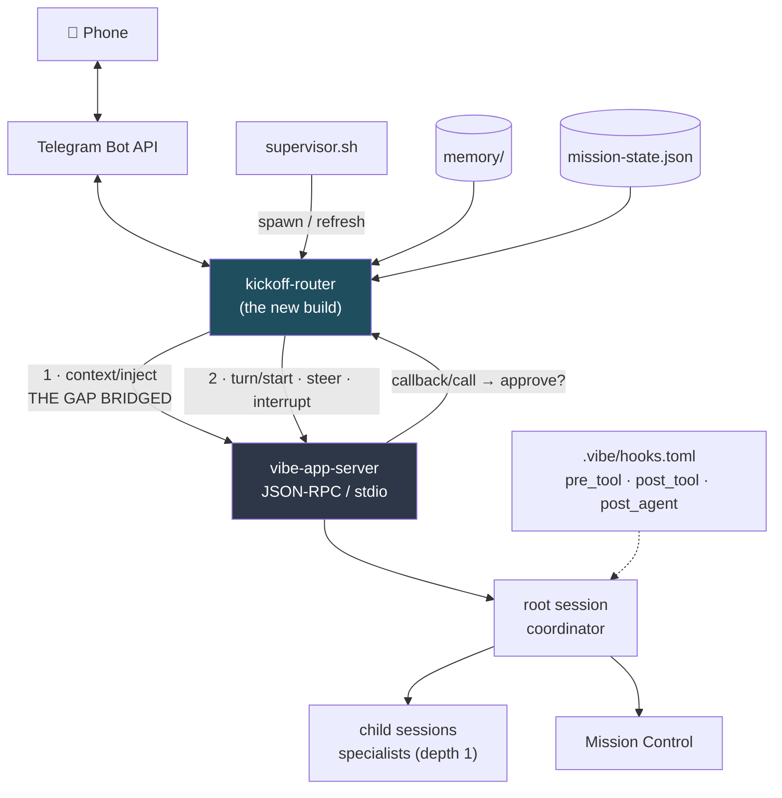

# The Mistral Vibe Port — Understanding and Plan

## 0. Citation audit (rejections first)

Every load-bearing claim below was re-verified by me directly against the clone. Two findings had bad evidence; both survive on corrected citations, and I am naming them rather than passing them through silently:

- **Rejected cite:** Lens 4's "subagents inherit AGENTS.md — `vibe/core/system_prompt.py:1036-1054`". That file is **437 lines long**; those line numbers do not exist. The claim itself holds on a *different* file — `vibe/core/agent_loop/_loop.py:1036-1054` (`_render_system_prompt`) plus `vibe/app_server/_runtime.py:409-440` (`_create_like` passes the parent's `harness_files` to the child). Claim accepted, citation corrected.
- **Rejected cite:** Lens 3 cited the PTY-wrap behaviour at `scripts/testdata/auth-heal/session-run.sh:181-216`. That is a **stale test fixture**, not the live engine — it still contains the `_PTY_WRAPPED=1` guard that the real script explicitly documents as a bug fixed on 2026-07-12. The live evidence is `$KICKOFF_VERSIONS/core-v0.32/scripts/session-run.sh:345-380`. Claim accepted, citation corrected.

Everything else I spot-checked came back exactly as reported: the `HookType` enum is three values (`vibe/core/hooks/models.py:20-23`), `session/context/inject` and `turn/steer` are both in the method catalogue (`vibe/app_server/protocol.py:135,160`), `inject_user_context` appends `injected=True` (`vibe/core/agent_loop/_loop.py:1140-1151`), programmatic mode auto-denies callbacks (`vibe/cli/programmatic.py:161-162`), `bypass_tool_permissions` short-circuits before the `NEVER` branch (`_loop.py:2282-2286` vs `:2301`), the scheduler is disabled when `headless=true` (`vibe/app_server/server.py:762,771,791`), `callback_kinds` defaults to empty (`vibe/app_server/_connection_protocol.py:36-40`), stdin is read to EOF unconditionally (`vibe/cli/cli.py:53-66,414`), subagent depth is hard-capped at 1 (`vibe/core/tools/builtins/task.py:96-101`), `allowed_tools` on skills has **no consumer anywhere in `vibe/`** (only `vibe/core/skills/models.py:65,79,81,102,135` — all definition, no enforcement), there is **no `glob.py`** in `vibe/core/tools/builtins/`, and `enable_telemetry` appears **nowhere** under `vibe/core/session/`.

---

## 1. Coverage

**All four lenses returned. None died.** Between them they read the worker lifecycle, the context/memory path, the channel and human-in-the-loop path, and the crew/skills/config surface — against the real clone (CHANGELOG top entry 2.24.1, 2026-08-11) and the real engine at core-v0.32. Nothing was installed, nothing was run, no API was touched, nothing under `$HOME` was modified.

**What remains unknown:** whether Mistral's models are actually good enough at this workload — long-horizon orchestration, adversarial review, honest self-reporting — because that cannot be read from source and is the one thing that decides whether the port is worth doing at all.

---

## 2. The verdict, in three sentences

**This is a rewrite of the harness layer and a translation of everything else** — the crew, skills, memory, tracker, Mission Control and Telegram plumbing all survive nearly intact, but the *spine* that connects them (the always-on session, the hooks that inject memory, the permission gate) has to be rebuilt as a program we own rather than configuration we hand to the engine. **The single hardest part is that one new component**: a long-lived "router" process that speaks JSON-RPC to `vibe-app-server`, owns the Telegram poll, injects memory before every turn, and relays approval requests to your phone — roughly one substantial build that replaces four kickoff mechanisms at once. **What we gain that we do not have today:** mid-flight steering of a running agent (`turn/steer`), a remote `/stop` button, a *mechanical* spend ceiling per dispatch (`--max-price`) instead of a promise, subagents that inherit the project charter by construction, and server-side scheduled loops that fire even when the router is idle.

The premise this investigation started from — "Vibe cannot inject context" — is **half wrong, and the wrong half is the good news.** Hooks genuinely cannot do it. But `session/context/inject` is a first-class protocol method that appends a silent user-role message into a live session with no turn started (`vibe/app_server/protocol.py:135`, `vibe/app_server/_turns.py:328-360`). That is a *better* primitive than the Claude Code hook we use today, because it is not tied to a prompt boundary. It just lives behind a door we currently do not knock on.

---

## 3. The parity table

Effort scale: **none** (nothing to do) · **config** (write a file, rename a variable) · **small** (a script or a translator) · **large** (a real build) · **blocked** (does not exist; must be worked around).

### The spine — the always-on worker

| Kickoff surface | Vibe equivalent | Effort |
|---|---|---|
| `claude --channels` (always-on inbound session, 30 refs) | **None at the CLI.** Interactive mode is a Textual TUI; there is no flag, socket, or FIFO. The persistent substrate is `vibe-app-server`, JSON-RPC 2.0 over stdio (`pyproject.toml:148`). | **large** |
| PTY wrap + `script(1)` + `tail -f /dev/null` keepalive (`session-run.sh:345-380`) | **Delete entirely.** Headless Vibe needs no TTY — and has the *inverted* trap: `get_prompt_from_stdin()` reads stdin to EOF unconditionally (`vibe/cli/cli.py:53-66`, called at `:414` before the mode branch). A never-EOF keepalive **hangs Vibe forever, silently.** Must run with `< /dev/null`. | **none** (delete) + **config** (new guard) |
| `UserPromptSubmit` hook (56 refs) | **Does not exist.** `HookType` is a closed enum: `POST_AGENT`, `PRE_TOOL`, `POST_TOOL` (`vibe/core/hooks/models.py:20-23`). | **blocked** |
| …its replacement | `session/context/inject` on the app-server, called by our router before `turn/start`. Silent injected user message (`_loop.py:1140-1151`). | **large** (part of the router) |
| `SubagentStop` hook (16 refs) | `post_agent`, branching on `parent_session_id != null` (`vibe/core/hooks/models.py:86-92`). Also: `pre_tool`/`post_tool` with `match = "task"`, reading `tool_input.agent` (documented at `vibe/core/skills/builtins/vibe.py:537-538`). | **config** |
| `--permission-mode` (16 refs) + plugin relaying prompts to phone | **Better by architecture.** The app-server sends `callback/call` to the client and waits for `callback/result` (`vibe/app_server/server.py:1114-1136`, `protocol.py:85`). Our router *is* the permission UI. | **small** (renderer) |
| Gated approvals under `vibe -p` | **Impossible.** Programmatic mode auto-denies every callback (`vibe/cli/programmatic.py:161-162`). Two states only: full YOLO or silent denial. | **blocked** |
| Exit-code-based health watching / auth-heal (~55KB) | **Auth-heal's reason for existing evaporates** — a static `MISTRAL_API_KEY`, no refresh token. But **exit codes are useless**: a turn that fails (rate limit, backend error) is swallowed into a `FAILED` turn and the process still exits 0 (`vibe/app_server/_turns.py:493-497`). Must parse `--output json` for turn status + `TurnErrorCode` (`vibe/app_server/models.py:272-283`). | **small** (parser) + delete 55KB |
| Session pinning / resume | `--resume <ID>` restores full context, same identity, same transcript (`vibe/app_server/_runtime.py:282-328`). ID readable from `--output json` (`sessionId` on every entry). **Ban `--continue`**: the per-TTY pointer is never written headless, so it silently degrades to newest-by-mtime (`vibe/core/session/last_session_pointer.py:25-38,70-82`). | **small** |
| Auto-pickup crash-loop guard (`session-run.sh:196-228`) | Pure bash, ports — **but its `[ -t 0 ]` predicate breaks.** With no PTY wrap and stdin at `/dev/null` it is always false, the restart counter never increments, and a guard whose job is stopping an unattended money-burning loop **fails open**. | **small** (re-anchor + selftest) |
| Bridge reap (`session-run.sh:384-402`) | No in-session bridge to reap; becomes a singleton lock on our own Telegram poller. The one-`getUpdates`-consumer constraint is Telegram's, unchanged. | **small** |
| Startup announce / direct curl to Telegram | Engine-agnostic, ports verbatim. Only the token source moves (`.claude/settings.local.json` → `$VIBE_HOME/.env` or a kickoff file). Keep the `curl -K -` argv-hiding trick and the crash-loop cooldown. | **config** |
| Remote `/stop`, `/refresh` from the phone | **New capability.** `turn/interrupt`, `session/compact`, `session/stop` (`protocol.py:152,158,133`). Kickoff has no equivalent today. | **small** |

### Memory, tracker, and the nudges

| Kickoff surface | Vibe equivalent | Effort |
|---|---|---|
| Per-turn memory recall (`memory-hook.sh` → `hook.mjs`) | Router calls `hook.mjs` itself and `session/context/inject`s the block before `turn/start`. **Same text, same position, moved from a hook into our code.** `hook.mjs` is reusable unchanged. | **large** (part of router) |
| …CLI-only fallback if we do not own the relay | `post_tool` with `match = "*"` + `additional_context` (`vibe/core/hooks/_post_tool.py:88-115`). **Three named losses:** nothing lands before the first tool call; a zero-tool-call turn gets nothing; and the hook cannot read the user's query on the first turn because `messages.jsonl` is written only after the turn completes (`_loop.py:1666`) — so relevance ranking degrades to recency. | **small** (degraded) |
| Agent-mail surfacing | `post_agent` with `{"decision":"deny","reason":"<mail block>"}` — becomes a user-role message and the loop continues (`vibe/core/hooks/_post_agent.py:31-65`). Capped at 3 retries per hook per turn (`_handler.py:25`). Cost: forces one extra assistant turn, so the operator may get a second beat. | **small** |
| Beat nudge (`beat-nudge.py`) | Two options, both better than today: `post_tool` matching the Telegram reply tool (measurement lands right after the beat it measures), or `loops/create` — a **server-side scheduler** that starts a turn on an interval (`vibe/app_server/protocol.py:1233-1241`, `server.py:978-999`). **Trap: the scheduler is disabled when `headless=true`** (`server.py:762,771,791`) — open the always-on session with `headless=false` even though no human is at a terminal. | **small** |
| Beat-length guard (`PreToolUse` deny) | `pre_tool` + `match` + `{"decision":"deny"}` — near-exact equivalent, and `pre_tool` can additionally *rewrite* `tool_input` (`vibe/core/hooks/models.py:225-232`), which Claude Code cannot. | **config** |
| `CLAUDE.md` charter | `AGENTS.md` at project root and `~/.vibe/AGENTS.md`, loaded verbatim into the system prompt, walked up to the trust root (`vibe/core/system_prompt.py:417-435`). | **config** (`cp` + rename) |
| A native recall *tool* | `.vibe/tools/*.py` loads arbitrary Python tool classes (`vibe/core/tools/manager.py:146-224`). Worth building as a pull-side complement. **Name the change honestly: today's recall is push (automatic, unforgettable); a tool is pull (the agent must remember to ask).** | **small** |
| `TRACKER.md` / `mission-state.json` / `mc-update.py` | Untouched — plain files and Python. | **none** |

### The crew and skills

| Kickoff surface | Vibe equivalent | Effort |
|---|---|---|
| `.claude/agents/*.md` (110 refs) | `.vibe/agents/<name>.toml` (config) **plus** `.vibe/prompts/<name>.md` (prose, via `system_prompt_id`). **One charter becomes two files.** | **small** (emitter) |
| Charter body semantics | **It REPLACES the base system prompt, it does not append** (`vibe/core/system_prompt.py:365`). Kickoff charters are written as additive. Every ported charter must be self-sufficient or pre-concatenated with `vibe/core/prompts/cli.md` (9.0K). Silent quality regression, not a crash. | **small** |
| Least-privilege `tools:` list | `enabled_tools` / `disabled_tools` — a **registry-level filter**, the model never sees the tool (`vibe/core/tools/manager.py:309-323`). **Critical:** express restrictions this way and *never* as `permission = "never"`, because `bypass_tool_permissions` returns EXECUTE before the NEVER branch is reached (`_loop.py:2282-2286`) — and the always-on worker runs auto-approve. Vibe's own `plan` profile relies on `never` and is therefore **not read-only under `--yolo`**; do not copy it. | **config** (+ one selftest) |
| Tool name mapping | `read_file`, `write_file`, `edit`, `grep`, `bash`, `skill`, `task`, `todo`, `web_fetch`, `web_search`. **There is no `Glob`** — pattern search folds into `grep`. MCP tools are `{server}_{tool}`. | **config** (translation table) |
| Per-dispatch model + effort routing | **Partial.** No `--model`, no `--effort`. Model pins live in the *agent profile* (`vibe/core/agents/models.py:110-149`). Routing becomes "pick an agent name", one profile per (function × tier). | **small** |
| Nested delegation (a specialist fanning out) | **Hard depth limit of 1** (`vibe/core/tools/builtins/task.py:96-101`). Kickoff's crew is flat, so survivable — but any skill where a specialist fans out further must fan out from the coordinator instead. Also: a `subagent`-typed profile can never be run standalone as `--agent`; wanting both means emitting two profiles. | **small** (reshape) |
| Dispatching a custom subagent at all | `[tools.task] allowlist` defaults to `["explore"]` only (`task.py:24-26`). Miss this line and every dispatch hangs on approval. | **config** |
| Subagents inheriting the project charter | **GAIN.** They do, by construction (`_runtime.py:409-440` → `_loop.py:1036-1054`). The `wire-canon-into-charters.sh` workaround becomes belt-and-braces. | **none** |
| `.claude/skills/*/SKILL.md` (13 skills) | Near 1:1 — dir-per-skill, `SKILL.md`, YAML frontmatter, `/name` invocation (`vibe/core/skills/manager.py:73-195`). All 13 names already satisfy the naming rules. `vibe` and `skill-creator` are reserved and a colliding local skill is **silently skipped** (`manager.py:119-125`). | **config** |
| Skill `allowed-tools` as a privilege boundary | **Parsed, stored, and never enforced** — no consumer in the package. Do not start using it. | **none** (avoid) |
| `crew-probe.py` (parses agent frontmatter) | Needs a `tomllib` reader path and new skill/prompt dirs. | **small** |

### Config, plugin, and deployment

| Kickoff surface | Vibe equivalent | Effort |
|---|---|---|
| `CLAUDE_CONFIG_DIR` (164 refs) | `VIBE_HOME` — relocates config, hooks, agents, skills, prompts, tools, logs, worktrees, trusted-folders (`vibe/utils/paths.py:69-72`, `vibe/core/paths/_vibe_home.py:6-22`). Mechanical rename. **One leak:** `~/.agents/skills` hangs off `AGENTS_HOME`, *not* `VIBE_HOME`, so it is not isolated per worker. | **config** |
| `--plugin-dir` (44 refs) — one bundle shipping agents + skills + hooks + MCP from the pinned core | **Does not exist.** No plugin concept, no marketplace, no path flag. `agent_paths` / `skill_paths` / `tool_paths` are config lists, but **hooks and MCP servers cannot be pathed at all** — they must be materialised into a `.vibe/config.toml` and `.vibe/hooks.toml`. **This reintroduces exactly the drift the source-exec design was built to eliminate.** Needs a regenerate-and-verify step on every engine hop, plus a re-derived origin-inertness guard. | **large** |
| `.claude/settings.json` | Splits: hooks → `.vibe/hooks.toml`; `enabledPlugins` → nothing. | **small** |
| `.mcp.json` (46 refs) | `[[mcp_servers]]` TOML, stdio, with per-tool permissions. Works headless — stdout is reserved for JSON-RPC and MCP subprocesses get their own pipes (`docs/adr/0009-app-server-boundary.md:140-141`). **But OAuth-authed MCP servers refuse to work headless** (`vibe/core/auth/mcp_oauth.py:71`) — the Telegram MCP must use a static env-var credential. Better still: `AgentConfig.mcp_servers` can be declared **per session over the wire** (`protocol.py:273-294`), retiring most config-dir juggling. | **config** |
| **The trust gate** — no kickoff analogue | Project `.vibe/` config, hooks, tools, prompts *and* project `AGENTS.md` are **all silently ignored unless the cwd is trusted** (`vibe/core/config/harness_files/_harness_manager.py:69-77`). A fresh adopter's headless worker boots with **zero crew, zero skills, zero hooks — and a green exit code.** Every headless invocation needs `--trust`. | **config** + a real boot assertion |
| Vibe rewrites `.vibe/agents/*.toml` in place | A migration pass runs before discovery and rewrites files via `tomli_w`, losing comments (`vibe/core/agents/registry.py:44,55-59`, `_migration.py:33-85`). And a malformed profile is **dropped silently with a log warning** (`registry.py:89-97`). | **config** (tolerate it) |
| Telemetry / determinism | Sessions do **not** require telemetry — the "sessions need `enable_telemetry`" claim is **false in source**. But telemetry is on by default and does phone home (`vibe/core/telemetry/send.py:38-39,93-95`). The stronger reason to disable it: **a remote GrowthBook flag can swap the worker's system prompt or model between restarts** (`vibe/core/config/layers/growthbook.py:48-62`). Pin `enable_telemetry = false` **and** `experiments.enable = false`. | **config** |
| Cost control | **GAIN.** `--max-price`, `--max-tokens`, `--max-turns`, enforced in runtime policy and **inherited by subagents** (`vibe/core/agent_loop/_loop.py:701-716`, `_runtime.py:421`). Today kickoff gates spend by convention plus a human; Vibe can gate it mechanically. | **config** |
| Provider flexibility | **GAIN.** A profile can carry its own `providers[]` with arbitrary `api_base` (`vibe/core/agents/models.py:117-146`) — the mechanical tier can point at a local endpoint at zero marginal cost. | **config** |
| Tailscale / Telegram / Mission Control / supervisor | Unaffected. Vibe has **no network listener** — both entrypoints are stdio. | **none** |

**Tally:** roughly 4 large builds, ~15 small, ~25 config, 4 genuinely blocked (all with named workarounds), and a meaningful list of things we simply delete.

---

## 4. The staged plan

Each slice is independently shippable and ends with a proof you can be shown.

### Slice 1 — The spike (½ day). *Prove the riskiest assumption before anything else.*

The whole plan rests on one unobserved fact: that an external process can drive a live Vibe session, push memory into it *before* it thinks, and catch an approval request. I read the code paths; I have not watched them run.

Build one ~150-line Python file that: spawns `vibe-app-server`, sends `initialize` with `callbackKinds: ["approval","user_input"]`, `session/start` with `headless=false` and `trust_workspace=true`, calls `session/context/inject` with a sentinel fact ("the launch code is BLUEFIN"), then `turn/start` asking "what is the launch code?", and finally triggers a gated shell command.

**Proof it works:** the model answers BLUEFIN, and a `callback/call` arrives at our process. **Proof the check can fail (RED-first, non-negotiable):** run the identical script with the inject removed and confirm the model does *not* know the sentinel — otherwise we have proven nothing but our own optimism. Second RED control: initialize with empty capabilities and confirm the gate errors rather than silently auto-approving.

If this slice fails, the entire architecture changes and we stop here. That is the point of doing it first.

### Slice 2 — The crew translator (1–2 days)

A generator that turns `.claude/agents/*.md` into `.vibe/agents/*.toml` + `.vibe/prompts/*.md`, moves the 13 skills, translates tool names, emits `[tools.task] allowlist`, and writes `hooks.toml` + `[[mcp_servers]]`.

**Proof:** a boot check that counts **discovered** agents and skills (not files on disk) and fails RED against a deliberately untrusted directory and a deliberately malformed profile — the two ways this surface fails silently. Plus a selftest asserting no charter uses `permission = "never"` for privilege.

### Slice 3 — The router (the big one, ~1 week)

The long-lived process: owns `vibe-app-server`, long-polls Telegram, injects-then-starts turns, renders approval and `ask_user_question` callbacks as inline keyboards, maps `/stop` to `turn/interrupt` and `/refresh` to compact-or-recycle, and enforces that the answering Telegram user is on the allowlist.

**Proof:** you send a message from your phone, the agent answers; you send a gated command, you get buttons; you tap deny, it stops. End to end, from the couch.

### Slice 4 — Memory, mail, and the beat (2–3 days)

Recall via router inject (`hook.mjs` unchanged), agent-mail via `post_agent`, beat nudge via `loops/create` with `headless=false`, beat-length guard via `pre_tool`. Plus the pull-side `recall` tool in `.vibe/tools/` as a complement.

**Proof:** a scripted conversation where a fact written to `memory/` in session A is recalled unprompted in session B — and the negative control where the memory file is absent and it is not recalled.

### Slice 5 — Lifecycle and failure honesty (2–3 days)

Session-ID pinning, `--resume` only (never `--continue`), the `--output json` failure parser, the re-anchored auto-pickup counter, the poller singleton lock, the startup announce, `< /dev/null` on every invocation plus a preflight gate for it. Delete the PTY block and 55KB of auth-heal.

**Proof:** feed the parser a synthetic `FAILED` turn with `RATE_LIMIT` and watch it go RED — because on this engine a dead worker exits 0, and a check built on exit codes would report green on a corpse.

### Slice 6 — Dispatch and cost (2–3 days)

Routing profiles per (function × tier) with `--max-price` ceilings, the reshaped flat fan-out, the `orphaned-work.py` reader for `<session>/agents/*/messages.jsonl`, and Mission Control lanes via `pre_tool`/`post_tool` on `task`.

**Proof:** a dispatch that hits its price ceiling and stops; a killed parent whose finished child output is still salvaged.

### Slice 7 — The stranger walk (1 day, and it is the cheapest bug-finder you have)

One person who did not build it runs the two stock commands on a clean box, told to report friction rather than route around it. Build the fixture as the **deploy topology** — an untrusted directory, a decoy config at the plausible-but-wrong default — never the dev checkout.

**Proof:** their friction list. The charter already paid four shipped rounds to learn that a real walk finds what reviews structurally cannot; the trust gate is precisely that shape of bug, waiting.

---

## 5. Open questions — only you can answer these

1. **Replace or run both?** Do you want Claude Code retired, or a dual-engine kickoff where the same crew runs on either? Dual costs maybe 30% more work and permanent maintenance; it also means you never bet the whole system on an unproven model.
2. **Is the model good enough — and how would you decide?** No amount of source reading answers this. I would propose one week of real work on Vibe before committing, judged by you, not by me.
3. **Push memory vs pull memory.** If we build the router, recall stays automatic. If you would rather not depend on a bespoke process, the fallback is a tool the agent must remember to call — measurably weaker, and the reason "session 40 is smarter than session 1" is a *push* property.
4. **Mid-flight steering: port or redesign?** Vibe lets you correct a running agent. Our charter is built around the assumption that you cannot. Do you want the system reshaped around this, or kept familiar?
5. **Are we building for you, or for adopters?** The trust gate, the silent-empty-crew failure, and the config-drift hazard are cheap to live with for one person on one box and expensive to make safe for strangers.
6. **Telemetry and experiments off?** I recommend both off — not mainly for privacy but because a remote flag can silently change your worker's prompt or model between restarts. The cost is losing upstream experiment improvements. Your call.
7. **Do we maintain a small fork?** Roughly 20 lines would make Vibe's existing per-turn injection pipeline config-loadable and close the memory gap *natively*, with no router dependency. Apache-2.0, so it is allowed. Fork, upstream PR, or neither?

---

## 6. What I could not determine from source

- **Whether injected context is actually consulted before the next inference.** The code appends to the live message list, which makes it near-certain. Near-certain is not observed. Slice 1 exists to convert this.
- **Whether child sessions actually run the post-turn hook dispatch.** The shared code path was traced; it was not executed. The SubagentStop replacement rests on it.
- **Whether list-valued config (`agent_paths`, `skill_paths`, `tool_paths`) can be set from `VIBE_*` env at all.** Every env test in the clone sets a scalar, and the path expander iterates its input — a bare string would iterate *characters*. If the plan leans on env-injected paths instead of generated config, that needs one real run first.
- **How the app-server behaves when its client disconnects mid-turn.** Directly relevant to supervisor design; not answered by anything I read.
- **Whether ACP exposes inject/steer.** I read its wiring and error mapping, not its full surface. Moot — it is a thin adapter over the same session object and demonstrably loses mid-turn steering, so the recommendation is to build on the app-server regardless.
- **Protocol stability.** The app-server landed 2026-07-28 and its own ADR names the *code* as the source of truth, not a versioned contract — and the ADR itself is already wrong about one method name (`callback/respond` vs the actual `callback/result`). We pin a Vibe version and fail closed on an unexpected method catalogue.
- **Textual TUI behaviour on a non-TTY.** Not verified, and not worth verifying — it is the wrong surface for this system either way.

---

## The diagram

The one thing to read off it: **everything that used to be a hook now runs inside the router**, and the arrow labelled *context/inject* is where the gap is bridged. That box is the whole project.