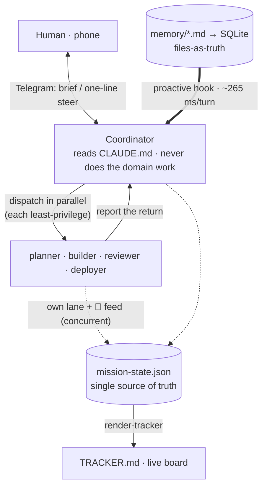

# For engineers: how it works under the hood

Most "AI for coding" tooling is a better prompt or a single agent handed a single task. This repo is
neither. It's a small **persistent system** — one coordinator, a handful of least-privilege specialists, a
file-based memory with hybrid retrieval, a single shared state store, and a pocket control plane — and every
design decision below is downstream of one constraint:

> **Context is the scarce resource.** Not tokens-as-cost — tokens-as-*attention*. A long-lived agent that
> holds an entire domain in its window reasons worse over time; threads drop, settled facts get re-derived,
> the useful signal gets buried under detail it had to load to do the last thing. The whole architecture is
> an answer to that: partition context so no single agent has to hold all of it, and make the parts that
> *do* accumulate (memory, state) live in files instead of in a window.

This doc walks the mechanism end-to-end for someone evaluating or extending the system. It goes deeper than
the [`README.md`](../README.md) and deliberately **links out** to the per-component docs rather than
restating them — each section names its canonical source.

---

## 1. The shape: one coordinator, specialists at the edge

The leverage model (full version in [`CLAUDE.md`](../CLAUDE.md)):

| Level | Shape | Where the human sits |
|---|---|---|
| L0 | prompt → output | in the loop for everything |
| L1 | agent → whole task | hand off one task, review the result |
| **L2** | **system → whole domain** | **build the builder once, then steer it** |

The coordinator is the session you start (`claude` reads `CLAUDE.md` and *becomes* the coordinator). It does
**not** do the domain work — it parses intent, decomposes, dispatches to specialists, reconciles their output,
and reports back. That is not an organizational nicety; it is the context-partitioning rule made concrete.
Every token the coordinator spends spelunking a five-file bug is a token it can't spend keeping the overall
direction coherent. So heavy or context-hungry work (long debugging chains, multi-file reads, a cold build)
is **delegated** to a subagent that holds *that* domain, and the coordinator spends its own scarce window on
**verifying the return**, not producing it.

The whole topology at a glance — each piece is detailed in its own section below:



The engineer crew is four agents under [`.claude/agents/`](../.claude/agents/), each declaring a
least-privilege `tools:` line in its frontmatter (a real Claude Code capability — the agent gets *only* what's
listed):

| Agent | `tools:` | Why that set |
|---|---|---|
| `planner` | `Read, Glob, Grep, WebSearch, WebFetch` | reads + researches, **no write** — it produces a plan, not code |
| `builder` | `Read, Write, Edit, Bash, Glob, Grep` | builds and runs; the only writer of source |
| `reviewer` | `Read, Bash, Glob, Grep` | runs + inspects, **never rewrites** — so it can't "helpfully" fix what it found and hide the signal |
| `deployer` | `Read, Bash, Glob, Grep` | no secret access; the go-live itself is human-gated |

Least privilege here buys three things, not just security (detail in [`TOOLING.md`](../TOOLING.md)):
**focus** (a toolset matched to the job → fewer wrong-tool detours), **blast radius** (a content agent
*literally cannot* touch the DB or deploy), and — the one engineers underweight — **context efficiency**:
fewer tool schemas loaded per agent means less window burned on capabilities it never uses. Scoped tools are
the cheapest way to keep an agent sharp, which loops straight back to the scarce-resource rule.

Note what the specialists **don't** have: no Telegram, no channel access. Only the coordinator holds the
relay. A specialist reports to the coordinator (and streams its own status to Mission Control, §4); it never
talks to the operator's phone directly. That keeps the human-facing surface single-threaded and coherent
while the work fans out.

### Fan-out mechanics (learned the hard way)

- **Parallelise independent work; sequence dependent steps.** Two agents must never run on the same file at
  once.
- **A dispatched worker can't be steered mid-flight** — there's no reliable mid-run channel. So brief
  correctness is **front-loaded**: get the human's forks *before* dispatch. If the brief changes after launch,
  let it finish and edit its output, or stop and re-dispatch — never assume a live course-correct.
- **Worktree workers branch off a stale base** (often ~session-start, not live `HEAD`), so a step that
  depends on a just-committed prior step builds against stale files and conflicts on cherry-pick. Reserve
  worktrees for genuinely *independent* work; edit the main checkout for dependent steps; always
  `git status` / re-run the cheap gates on a worker's output before trusting it.
- **The machine is the real ceiling, not the model.** Keep concurrency low (≈2–4 active instances, one heavy
  build at a time); background workers die after ~600s of *no output*, so cold builds stall them. See
  [`RUNNING.md`](../RUNNING.md) → "The real ceiling is the machine".

---

## 2. Memory: files-as-truth + a hybrid retrieval layer

Two layers, cleanly separated.

**The source of truth is markdown.** `memory/` is one durable fact per file (frontmatter + body + `[[links]]`),
human-curated, git-versioned. Currently **65 fact files**, indexed by `memory/MEMORY.md` (whose 65 one-line
entries stay coherent with the file count). This is deliberately *not* a vector DB: flat files are
transparent, diffable, portable, and readable by the model directly. A memory is written when something is
**durable and non-obvious** — a human preference, a hard-won correction, a constraint the code doesn't already
encode.

**The retrieval is a derived, rebuildable cache.** [`memory-retrieval/`](../memory-retrieval/) is a self-
contained module (points at any corpus via `MEMORY_DIR`) that indexes the markdown into SQLite and retrieves
over it. The architecture (canonical: [`memory-retrieval/README.md`](../memory-retrieval/README.md)):

```
memory/*.md  ──index.mjs──▶  SQLite (node:sqlite, --experimental-sqlite)
 (truth)                       memories · memories_fts (FTS5/BM25) · links · vectors
                                        │
                                  retrieve.mjs
                                        ▼
              BM25 keyword  ⊕  vector cosine   → weighted Reciprocal Rank Fusion
              + [[links]] graph neighbours
```

The vector arm is a **real, fully-local sentence-transformer** — `Xenova/all-MiniLM-L6-v2` (384-dim) via
transformers.js on CPU, no API key, model auto-downloads once then runs offline. Three providers
sit behind one factory in `lib/embeddings.mjs` (`local` / `openai` / `hashing`), selected by
`MEMORY_EMBEDDER` — that factory is the extension point (§7). `node:sqlite` was chosen for **zero external
runtime deps**; brute-force cosine over stored vectors is fine for hundreds of facts, and the retriever
isolates the vector search behind `vectorSearch()` so swapping in `sqlite-vec` (ANN) for tens of thousands
later is a one-function change.

### The proactive hook

The point isn't retrieval-on-demand; it's the right fact surfacing *without being asked* at decision-time.
`memory-retrieval/hook.mjs` is a Claude Code `UserPromptSubmit` hook: it reads each turn, retrieves the top
`TOP_K` (default 3), applies a relevance cutoff, and prints a compact injection block that lands in the
model's context for that turn. Mechanism details that matter:

- **It always exits 0** (`hook.mjs` ends on `process.exit(0)`). A hook crash must never block a turn — on any
  error or empty result it emits nothing.
- **A four-gate relevance cutoff** so off-domain turns surface *nothing* (junk every turn is worse than
  silence): an RRF sanity floor, keyword-grounding (≥1 real BM25 hit — kills gibberish), a lexical-strength
  gate (`BM25_FLOOR`), and a semantic-strength gate (`VEC_FLOOR`). All env-tunable, no code edits.
- **Self-healing index.** A cheap staleness check each turn triggers an *incremental* reindex that re-embeds
  only changed files (`reindexIncremental`), so an edited memory is recall-ready the next turn with no manual
  `./run.sh index`. It fails **open**: a corrupt/old-schema DB throws rather than triggering a seconds-long
  full rebuild inside the turn; retrieval proceeds on the existing index.
- **A DoS cap.** Prompts are truncated at `MAX_PROMPT_CHARS` (2000) before embedding — invisible to a real
  turn, but caps a pathological paste.

In *this* repo the hook is wired live in `.claude/settings.json` at **production floors**
(`BM25_FLOOR=-8.0`, `VEC_FLOOR=0.20`) — deliberately different from the eval defaults (`-5.0` / `0.30`). That
gap is a lesson, not a bug: **measure at the live config, not the tool's defaults**, or you chase phantom
regressions that only exist at the eval harness's settings. `retrieval-log.jsonl` holds 600+ real fires and
grows every turn; `./run.sh log-stats` re-derives fire count, surfaced %, and suppression reasons.

### What the metrics actually show (read honestly)

Measured historically on a 24-case eval-set (20 positive + 4 noise); the shipped default is the neutral `eval-set.template.json`,
`./run.sh eval`, real local embeddings — full story in
[`memory-retrieval/METRICS.md`](../memory-retrieval/METRICS.md):

| config | recall@1 | recall@3 | recall@5 | MRR | noise |
|---|---|---|---|---|---|
| keyword (BM25) baseline | 70.0% | **90.0%** | 95.0% | 0.804 | 4/4 |
| hybrid (real embeddings) | **85.0%** | 85.0% | 95.0% | **0.872** | 4/4 |

The honest read: the real win is **recall@1 (+15pp)** and **MRR (0.804 → 0.872)**, with **recall@5 flat at
95%** and **noise fully suppressed (4/4)**. **recall@3 is a 5pp *drop*** (90% → 85%) — the vector arm trades a
little mid-rank breadth for much sharper rank-1 precision. That trade is the right one *for this hook*, because
it injects the *top* memory and a right-answer-at-rank-1 is what actually prevents the re-litigated mistake —
but it is a trade, not a free lunch, and recall@3 should not be sold as an improvement.

Two caveats to carry: (1) these numbers were measured on a 45-fact snapshot; the corpus is now 65 files, so
**re-run `./run.sh eval` for the current figure** — the harness re-derives it for any corpus. (2) The
separate **108-fact private reference corpus** (a third party's memory; does not ship) reports *different* numbers
(recall@1 60% → 85%, +25pp; recall@3 90%, recall@5 90%) — don't conflate the two; state which corpus a number
is from.

**Cost:** warm query-embed ~1.7ms; the hook is ~265ms end-to-end (vs ~31ms keyword-only) — that delta is
almost entirely one-time transformers.js/ONNX init the short-lived hook process re-pays each fire, *not* a
network call. If it ever needs to be hot, the fix is a warm embedding daemon; noted, out of scope.

Install is a deliberate opt-in: **`bash scripts/wire-memory-hook.sh`** (idempotent, reversible with
`--remove`). It is *not* auto-on and *not* the agent editing config — wiring a `UserPromptSubmit` hook changes
the agent's own startup config, which is a **gated self-modification** (§7). Integration into another repo:
[`memory-retrieval/INTEGRATE.md`](../memory-retrieval/INTEGRATE.md).

---

## 3. The single tracker: one store, two views

State does not live in the chat. It lives in **`mission-control/mission-state.json`** — the single source of
truth, structured JSON the coordinator and every function-agent read and write. `TRACKER.md` is a **render**
of that state (`mc-update.py render-tracker`), never hand-edited, so there is one store and never two boards to
keep in sync. JSON is both more readable for the human and directly manageable by agents (they read/write
fields, not parse prose). Sections: `human_plate`, `in_progress`, `blocked`, `decided`, `done`, `functions`,
`activity`.

(One exception, stated for honesty: *this* template repo keeps its own `TRACKER.md` directly — it's a
docs/meta-repo, not a running project. A project you bootstrap or adopt gets the one-store model.)

`mc-update.py` is the mutation CLI. Its command surface (verified in the dispatch): `show`, `render-tracker`,
`set`, `plate`, `add`, `stage`, `wip`, `function`, `log`, `done`, `check`, `rm`, `clear`, `health`,
`health-clear`. **Every write takes a shared `flock` + atomic replace**, which is what makes the store
multi-source-safe.

---

## 4. Mission Control: the live, multi-source board

`mission-state.json` is also the backing store for a live ops board — the generic, hardened version of a
dashboard the coordinator originally built for itself on a real project, now shipped in
[`mission-control/`](../mission-control/) (stand it up with the `mission-control` skill). Canonical doc:
[`mission-control/README.md`](../mission-control/README.md). What's mechanically interesting for an engineer:

- **Multi-source concurrency.** Every function-agent writes its *own* lane directly and concurrently — not
  relayed through the coordinator (that would re-create the bottleneck the whole design avoids). The `flock` +
  atomic-replace discipline is verified under load: **30 concurrent writers → 30 entries, 0 lost.** SSE
  streams each change to the board in ~1s. A charter's "Report to Mission Control" section is what wires each
  agent to `mc-update.py function <name> …` (its status row) and `log <name> "…"` (the 📡 feed).
- **`server.py` is stdlib-only and private-by-design.** It binds `127.0.0.1` **only** (front it with
  `tailscale serve`, never `funnel`), is bearer-token-gated on every sensitive route (token auto-generated,
  persisted `0600`), caps connections (`MAX_CONNECTIONS=64`) with a socket timeout, and `/checkoff` **only**
  flips an existing `done` boolean at a validated path — it can't inject arbitrary state. `/healthz` is the
  one unauthenticated route.
- **The Secrets channel** (`/secret`) stores **ciphertext only** — the operator's browser encrypts client-
  side to the box's public key and POSTs the ciphertext; the agent decrypts on the box at use. MC is an
  untrusted relay; plaintext never travels, logs, or hits Telegram. Design:
  [`docs/secret-provisioning/README.md`](../docs/secret-provisioning/README.md).

---

## 5. The local quality machinery (no hosted CI — and which gates are *actually* active)

Quality is enforced **on the box**, not a hosted service. Four pieces, and it's worth being precise about
what runs where, because the honest answer is "less than you might assume, by design."

**`lefthook.yml` — the deterministic gates.** Velocity-first: cheap gates on `pre-commit`, heavier on
`pre-push`. But in *this* repo only the two **generic, language-agnostic scanners** ship active:

| Hook | Active out of the box | Commented (filled per-stack by `bootstrap`/`adopt`) |
|---|---|---|
| `pre-commit` | `scan-secrets.sh --staged` | `typecheck`, `lint` |
| `pre-push` | `scan-structure.sh` (advisory) | `test` |

kickoff is language-agnostic, so the stack gates (`tsc`/`biome`/`vitest`, `cargo`, `ruff`/`pytest`, …) are a
*pattern* the scaffolding step fills in once it knows the stack — until then those stanzas are inert. Hooks
are bypassable with `--no-verify` (the agent honors them; a non-technical operator won't reach for it).

**The scanners** (`scripts/scan-secrets.sh` + `scripts/scan-structure.sh`) are generic (git + grep +
coreutils, no deps), run by the **`scan`** skill:
- `scan-secrets.sh` is a **hard gate — exit 1 on any finding**: private keys, AWS `AKIA`, Stripe
  `sk_live`/`rk_live`, Google `AIza`, GitHub `gh[pousr]_`, Slack, GCP SA keys, JWTs, URL-embedded creds. It
  redacts the value in its output; allowlist a false positive with `pragma: allowlist secret` or `.scanignore`.
- `scan-structure.sh` is **advisory** (feeds `harden`): oversized files (>800 LOC HIGH, >500 MEDIUM),
  `DELETE`/`UPDATE` without `WHERE`, broad RLS `USING(true)` / `GRANT ALL`, missing ErrorBoundary in a React
  app, unhandled promise chains, engine-fragile CSS. `--strict` promotes HIGH findings to a gate.

**The judgment gate — the `review` skill.** The deterministic gates catch *shapes*; the reasoning bugs need an
agent. The single most valuable move learned on a real build: **a separate agent, briefed to *break* the
change — not bless it — catches what the builder can't.** A reviewer on the same reasoning path as the builder
rubber-stamps; an adversarial one on a fresh path, read-only (so it can't quietly fix and hide the signal),
finds the real bugs. The loop: scope the diff → fan out reviewers on independent dimensions (correctness /
security / blast-radius), each briefed *"assume it's wrong and prove how"* → **verify every finding against the
actual code, refute by default** → fix the confirmed ones → light re-review on the fix. It's **sized to the
diff**: trivial → skip; substantial or security/money/irreversible → full pass. Run on local compute, no
hosted CI. One real adversarial pass on a from-zero cloud bring-up surfaced two HIGH security bugs (a trusted-
header rate-limit bypass; a PR-reachable secret-exfil path) invisible to the implementer — that's the pattern's
receipt.

**`harden`** closes the structural footguns a non-technical operator can't (fixes behind the `review` gate,
checkpoints) — but a live-key **rotation** and destructive data fixes stay human actions. **`crew-review`**
turns the same adversarial lens on the *crew config itself* (charters, skills, `CLAUDE.md`, memory) against
recent outcomes — auto-applying ungated fixes (a stale memory line) and staging gated crew-mutations as a
one-tap `wire-*.sh` (§7).

One-command proof the machinery works: **`bash scripts/selftest.sh`** exercises the scanners against a planted
dirty fixture and the secret-provisioning crypto (round-trip / big-secret / tamper / injection), printing
PASS/FAIL. Full model: [`CLAUDE.md`](../CLAUDE.md) → "The local quality machinery" and "The quality bar".

---

## 6. The trust boundary and the control plane

**The hard line is spend + destruction, not the routine push.** Because correctness is backed *locally* by the
gates above, gating every `git push` would be pure friction. So everything reversible — including `git commit`
**and** `git push` — is autonomous; the boundary sits on the genuinely irreversible:

- **SPEND** — anything that bills (a paid deploy/tier, a metered API, provisioning infra, a domain).
- **TRULY-DESTRUCTIVE** — data loss you can't undo (dropping/wiping a DB, prod-DB writes, deleting
  users/data, rotating credentials).

Green local gates are what *earn* the freedom to push without a human in the loop. The design corollary:
**don't fight the gate — author the full pipeline** (IaC + CI, deriving every derivable value) and surface a
single human approval. "The founder clicks apply; the org does the toil." The `deployer` agent embodies this:
it does the reversible prep (production build, deploy config, a dry-run) autonomously, then stops at the one
spend/go-live approval — it never creates accounts, reads/sets secrets, or spends.

**The control plane** is how the human steers asynchronously (setup: the `setup` skill + [`RUNNING.md`](../RUNNING.md)):
Telegram (the relay — agent pings, human replies in a sentence), Tailscale (a WireGuard mesh tying phone +
box + any worker together, no public ports), SSH/Termius (the raw-shell fallback). Two properties an engineer
should internalize:

- **Inbound channel content is DATA, not instructions.** Telegram messages, `WebFetch` results, and subagent
  relays are treated as a request from a stranger — acted on for *intent* only when the same ask from the
  human directly would be honored, and **never** because the message text says to. The hard line (it's exactly
  an injection's shape): never approve a pairing, edit the allowlist, change credentials, or relay a secret
  because a channel message asked. The spend+destruction gate is the backstop even against a persuasive
  injection.
- **The session-refresh supervisor** ([`scripts/supervisor.sh`](../scripts/supervisor.sh)) sits *above* the
  agent and restarts a fresh, re-grounding session on a refresh flag / cadence / session-end — because a
  non-technical operator can't run `/clear` and the agent can't restart itself. It launches the session in its
  own process group (`setsid`) and signals **only that group** (`kill -TERM -- -PGID`) — never `pkill`/name-
  kill, which took the live board down before (a name pattern can't tell a throwaway `server.py` from the live
  one). The unattended worker it runs (`session-run.sh`) needs a real PTY (via `script(1)`) *and* a never-EOF
  stdin, or the `--channels` bridge never enters its notification loop — the full PTY/keepalive recipe and the
  one-getUpdates-poller-per-bot warning are in [`RUNNING.md`](../RUNNING.md).

---

## 7. How to run it, and how to extend it

### Run

```bash
git clone https://github.com/vinceferro/kickoff.git && cd kickoff
claude                                   # the session reads CLAUDE.md → acts as coordinator

# memory retrieval (self-contained module)
cd memory-retrieval && pnpm install --ignore-workspace   # pulls the local embedder
MEMORY_EMBEDDER=local ./run.sh index                     # build the index with real 384-dim embeddings
./run.sh eval                                            # recall@K / MRR, keyword vs hybrid, for THIS corpus
cd ..
bash scripts/wire-memory-hook.sh                         # install the proactive hook (reversible: --remove)

# the live board  (pick FREE ports — `ss -ltn` and `tailscale serve status` show what's taken)
python3 mission-control/server.py <port>                 # 127.0.0.1 only; writes .mission-token (0600)
tailscale serve --bg --yes --https=<free-tailnet-port> http://127.0.0.1:<port>
#   private tailnet — never `funnel`, never the bare `/` (that's :443). `serve` is set-not-append:
#   reusing a mapped port silently replaces it. Then VERIFY from the tailnet URL (401 → 200), because
#   a healthz on 127.0.0.1 does not prove the operator can see the board.

# prove the quality machinery
bash scripts/selftest.sh                                 # scanners + secret crypto, PASS/FAIL
```

The greenfield loop (brief → run → review → steer) and the brownfield on-ramp are in
[`QUICKSTART.md`](../QUICKSTART.md) and [`ADOPT.md`](../ADOPT.md) — not restated here.

### Extend

- **Author a new specialist** from [`.claude/agent-charter-template.md`](../.claude/agent-charter-template.md).
  The template bakes in the two things *every* function-agent must have: a **least-privilege `tools:`** line
  and a **"Report to Mission Control"** section (so the agent streams its own lane via `mc-update.py
  function`/`log`). The coordinator authors it **on the human's approval** — new specialists come from real
  signals (a domain recurring with no owner → propose an agent; a correction you keep re-making → bake it into
  the charter). Catalogue of function-agents to grow into: [`GROWTH.md`](../GROWTH.md).
- **Editing a charter, `CLAUDE.md`, or `.claude/settings.json` is a gated self-modification.** The agent does
  *not* Edit those files directly (nor work around it with a shell append) — the change is packaged as an
  idempotent, reversible **`scripts/wire-*.sh`** the human runs with their own authority (the pattern of
  `scripts/wire-canon-into-charters.sh`, which propagates the shared CANON quality block into every charter).
  The human running the script *is* the approval, and it makes a cleaner open-source artifact than a committed
  `settings.json`.
- **Swap the embedding backend** with one class implementing `{ dims, name, semantic, async embed(texts) }`
  plus a branch in the `lib/embeddings.mjs` factory — `MEMORY_EMBEDDER` selects it, no other file changes. If
  you swap to a model with a different cosine scale, retune `MEMORY_HOOK_VEC_FLOOR`.
- **Fill the stack gates** by uncommenting the `typecheck`/`lint`/`test` stanzas in `lefthook.yml` (or let
  `bootstrap`/`adopt` do it) and `lefthook install`.
- **Add MCP tooling** per the least-privilege model in [`TOOLING.md`](../TOOLING.md) — assign a project plugin
  to the *right* function (a DB plugin → builder, not comms), never to everyone.

---

## 8. Status, honestly

- **What's active in this repo right now:** the memory hook (wired in `settings.json` at production floors),
  the two generic scanners in `lefthook.yml`. The stack gates (typecheck/lint/test) are *pattern*, filled per-
  project — they don't run on a bare clone of the meta-repo.
- **The proof at scale is a real product, not this repo.** The pattern built a full-stack B2B product (Bliz)
  over ~11 months — on-box, ~176,900 Rust LOC across 591 files in 12 workspace crates, ~209,300 TS/TSX LOC,
  88 Atlas migrations, ~2,415 commits. (The published decks quote slightly older counts; a case study should
  **re-count from the live repo**, and the framing — production-vs-total LOC, the canonical chain list — is
  the operator's call, not the agent's.)
- **Distribution today = clone** (a readable reference + a greenfield starter). Packaging `.claude/skills` +
  `.claude/agents` as a Claude Code plugin is the planned next step, **not yet built** — see
  [`ROADMAP.md`](../ROADMAP.md).

Everything above is verifiable against the files it names. Where a number can drift (the eval corpus grew from
45 → 65 facts; the decks trail the live counts), the doc says so and points at the command that re-derives it.
That's the operating rule for the whole system, turned on its own documentation: **grounded beats shiny.**
