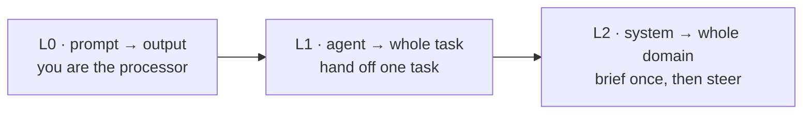
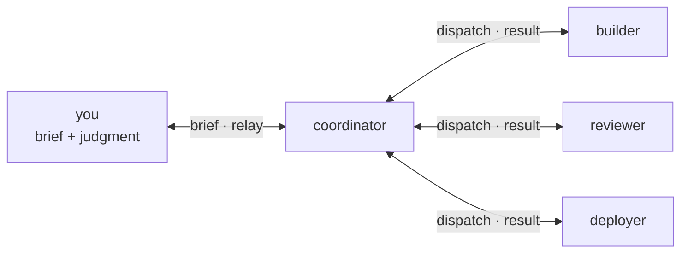
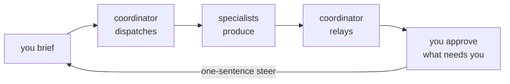

# What is this — and why?

*The **why** behind kickoff. Exact commands: [`QUICKSTART.md`](../QUICKSTART.md). Full manual: [`CLAUDE.md`](../CLAUDE.md).*

## The short version

Most AI tools answer one thing at a time. You type, it types back — and you hold the whole project in your head. That works. It also makes you the bottleneck.

kickoff asks a different question: **what if you build the builder, not the output?** A small, persistent system of agents you brief once and then steer. It scaffolds, writes and runs the test, remembers what it learned, and works while you're elsewhere. You bring the idea and the judgment; it does the labour. The work is async — a phone is enough to steer it.

One line: **build a system that builds systems — and run it from your pocket.**

## Three levels of leverage

Watch the leverage climb:

- **L0 — you prompt, it answers.** Every step routes through you; the whole project lives in your head.
- **L1 — you hand off a task.** One agent takes "add a login page" end to end; you review. Real leverage — but it's one thread, and a session reset wipes what it knew.
- **L2 — you run a system that owns a domain.** You brief and steer; a coordinator breaks the work down, dispatches specialists, keeps shared memory and one tracker, and reports back.

This repo is the L2 substrate. The description is one sentence; the change in your day is not: **you stop being the processor and become the one who steers.**

## What that actually looks like

A coordinator you brief, a crew it dispatches to:

An evening: you send a one-line brief — *"build a small link shortener, keep it tiny, add a test"* — and put your phone away. The coordinator proposes a stack, hands it to a `builder`, has a separate `reviewer` run the test, and pings you the result and how to run it. Steer with a sentence — *"make it shorter"* — and it refines, not restarts.

You approve only what genuinely needs you: spending money, a secret, anything that can't be undone. Everything reversible — writing files, scaffolding, testing, committing — it just does, and tells you. **The trust line sits on spend and destruction, not the routine work.**

One run needed a place to track itself, so the system built one: **Mission Control**, a live board — security-passed and kept. Nobody planned it; it's just what a system that builds things does.

## What you can do with it

- **Spin up something new.** Give a brief, get a running, tested first slice — a green test or a live server, not a blank page.
- **Adopt a repo you already have.** Most work isn't greenfield: drop the pattern into an existing codebase and steer it the same way. ([`ADOPT.md`](../ADOPT.md)) A live, already-AI-steered brownfield app adopted the whole system this way — additively and reversibly — told by shape in [`docs/adoption-story.md`](./adoption-story.md).
- **Grow an org, not just code.** When work keeps recurring off the build path — comms, growth, data — ask the coordinator to author a specialist: it drafts the charter, you approve, it joins the crew. ([`GROWTH.md`](../GROWTH.md))

The proof it isn't a toy: a real, full-stack B2B product was built this way over months — steered, tested, shipped.

## Why this isn't "a better prompt" or "one agent"

A great prompt is still L0. One capable agent is L1. The difference here is structural — four things a lone chat window can't have:

- **Parallel** — many agents work at once, each on its own piece.
- **Persistent** — memory accumulates on disk, so session 40 is sharper than session 1. A fresh chat forgets your project; this doesn't.
- **Async** — work happens while you're elsewhere. Brief, leave, come back to a result.
- **Context-partitioned** — each specialist holds its own slice, keeping the coordinator free to coordinate.

Not a smarter answer — a system that owns a domain and works while you don't.

## Is it for you — and what does it cost?

**Who it helps.** For an engineer: more throughput per unit of attention. For a non-technical builder: building at all. Either way, the vision and every real call stay yours. **It multiplies a builder; it doesn't replace one.**

**What it costs.** Free (MIT). It runs on your own [Claude Code](https://claude.com/claude-code) and model, so the cost is your usual model usage — a starting point you steer, not a result you accept blind. You'll need Claude Code plus your stack's toolchain (Node, cargo, and so on); the pocket control plane — Telegram plus Tailscale — is optional.

**What it won't do.** It doesn't write production software unattended, it doesn't run itself, and it doesn't take the judgment off your plate. Those aren't gaps to fix later; the line is there on purpose. Grounded beats shiny.

## How to start

It's one loop:

1. **On something new.** Clone the repo, run `claude` in the root (it reads `CLAUDE.md` and becomes the coordinator), and give a one-line brief. Full commands and a first brief: [`QUICKSTART.md`](../QUICKSTART.md).
2. **On a repo you have.** [`ADOPT.md`](../ADOPT.md) adds the coordinator, specialists, and tracker to an existing codebase.
3. **From your pocket.** Wire the control plane — a Telegram relay and a Tailscale mesh ([`README.md`](../README.md) walks it). Then a phone runs the whole thing.

That's the loop: **brief → run → review → steer → run again.** Give it one small thing tonight — the fastest way to feel what "L2" means.

---

*Going deeper: [`README.md`](../README.md) the full front door · [`GROWTH.md`](../GROWTH.md) starter → system · [`memory-retrieval/METRICS.md`](../memory-retrieval/METRICS.md) how the memory claim is measured · [`CLAUDE.md`](../CLAUDE.md) the coordinator's manual.*
